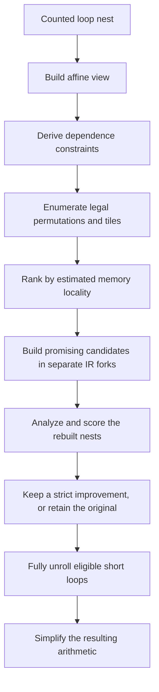

# Affine loop optimization

The order of loop iterations affects how often a program fetches data from
memory. Two loops can compute the same result but use the cache differently.
Changing their order can help, provided that each iteration still sees the
values it needs.

TIR's affine engine describes iterations and memory addresses with linear
expressions. It uses those expressions to check dependencies, compares legal
loop orders and tile shapes, and rebuilds the chosen loop nest. It also fully
unrolls short loops when their bodies are small enough.

This chapter explains that model and its limits. The engine operates on the
shared IR described in [Core IR](core_ir.md). [RVSDG and control flow](rvsdg.md)
explains the graph regions and memory dependencies that supply its input.

## Iteration order and memory locality

Consider a rectangular array stored row by row. In the following loop nest,
each iteration of the inner loop visits a different row:

```c
for (int j = 0; j < columns; ++j)
	for (int i = 0; i < rows; ++i)
		a[i][j] = 0;
```

A cache fetches adjacent bytes together in a cache line. Walking across a row
uses those bytes close together in time. Walking down a column may fetch a
different line at each step. Interchanging the loops makes the inner loop
walk across a row:

```c
for (int i = 0; i < rows; ++i)
	for (int j = 0; j < columns; ++j)
		a[i][j] = 0;
```

Each assignment here writes a distinct element, so changing iteration order
preserves the result. That argument does not hold for every loop. An iteration
that reads a value written by an earlier iteration must remain after that write.
The engine separates these two questions: whether a schedule is legal, and
whether a legal schedule is worth building.

## An affine view of the existing program

A counted loop has a lower bound, an upper bound, and a step. Its iterations
can be numbered from zero, even when its counter starts elsewhere. For example,
a counter starting at five with a step of two has the value `5 + 2 * t` at
iteration `t`.

An affine expression adds a constant to variables multiplied by constant
coefficients. `5 + 2 * t` is affine. So is `4 * i + 8 * j + offset`, where
`offset` is a value fixed throughout the nest. A product such as `i * j` is
not affine because its coefficient changes with another iteration index.

Memory addresses are described as a base object plus an offset in bytes.
For an array of four-byte elements with a fixed row length of 100, the offset
of `a[i][j]` is `400 * i + 4 * j`. These coefficients reveal how far an access
moves when either loop advances. If the row length is a runtime parameter,
the product of that parameter and `i` falls outside this constant-coefficient
model.

The engine builds an `AffineView` over a counted loop nest. The view records
the iteration bounds, invariant values, memory accesses, and dependencies.
It also classifies values carried between iterations, such as counters and
accumulators. The view is temporary analysis data. The program remains in its
existing IR, and a consumer decides which parts of the view justify a rewrite.

The graph IR supplies two kinds of information. Loop interfaces expose bounds
and values carried between iterations. Memory state chains record the required
ordering of accesses that may affect the same memory. An access can belong to
several chains when it may alias several objects.

Reading an expression as affine is not enough to prove its machine arithmetic
behaves like integer arithmetic. A narrow integer can wrap. The analysis tracks
possible wraparound and refuses dependence proofs that rely on an address
expression remaining within its source width.

## Dependencies constrain the schedule

A dependence is an ordering requirement between computations. For memory,
the engine examines access pairs that share a possible memory chain and contain
at least one write. Two reads alone do not impose a memory ordering requirement
between iterations.

Suppose one iteration writes `a[i]` and the next reads that element as
`a[i - 1]`. The second iteration needs the first iteration's result. Their
distance is one iteration. In a nested loop, a distance has one component per
loop. A distance of `(0, 1)` connects iterations in the same outer iteration
and consecutive inner iterations.

A legal schedule keeps dependencies pointing forward. The engine reads a
distance from the outermost loop inward. The first nonzero component must be
positive. Interchanging loops also interchanges those components. A dependence
with direction `(1, -1)` points forward in the original order but backward
after interchange, so that interchange is illegal.

The memory test starts with byte ranges. Two accesses can conflict if the
range read or written by one overlaps the other's range. For a shared base
and matching affine coefficients, subtracting their offsets gives a linear
constraint on the distances between iterations.

The engine uses two tests to rule out impossible distances. Banerjee bounds
estimate the range that the expression can reach within the loop bounds.
A greatest-common-divisor test checks whether the coefficients can reach a
required integer offset at all. The tests are conservative: a surviving
distance may still be impossible. Keeping such a distance can prevent a useful
optimization, but does not justify an unsafe reordering.

The analysis distinguishes four outcomes:

- Independent accesses impose no cross-iteration ordering requirement.
- Distance or direction information constrains the allowed iteration order.
- A conditional result requires proof that two objects' accessed byte ranges
  are disjoint.
- An unknown result means the analysis cannot establish the needed ordering.

Independence between iterations does not authorize reordering operations
within an iteration. Those operations retain their value and state dependencies.
The current scheduler also refuses conditional and unknown results. It does
not turn conditional results into runtime alias checks with separate optimized
and fallback loop copies.

## Search among legal schedules

A schedule describes the order of the loops and which dimensions use tiles.
The scheduler enumerates loop permutations and a bounded set of tile sizes.
Dependence constraints remove illegal candidates before the cost model ranks
the remaining choices.



Interchange changes which array dimension the innermost loop visits. Tiling
groups iterations into smaller blocks so that data used repeatedly can remain
in the cache. For matrix multiplication, a tile lets several nearby output
elements reuse parts of the input matrices before the computation moves on.

Tiling replaces a loop with an outer loop over tiles and an inner loop over
iterations within each tile. Tiling several dimensions puts the tile loops
outside the corresponding inner loops. The tiled dimensions must form one
contiguous band in the chosen loop order. The engine requires that no dependence
run backward within that band.

When a tile does not divide the iteration count evenly, strip-mining creates
whole tiles followed by a remainder loop. The current rebuilder supports this
case for a single tiled dimension. Tiling several dimensions requires complete
tiles in each of them.

The cost model estimates memory traffic from byte strides and iteration counts.
It estimates whether a working set fits in a modeled cache capacity and how
often surrounding loops revisit that working set. Innermost-loop locality
distinguishes schedules with similar total traffic. Unknown trip counts use
an estimate, so the ranking remains a heuristic rather than a runtime guarantee.

The arranger, TIR's shared placement solver, ranks the candidate schedules.
The pass builds a small set of promising candidates in separate forks of the
IR, then scores the nests that actually result. A candidate replaces the
original only if its modeled cost is strictly lower. A rejected fork is
discarded without changing the original program.

This second comparison matters because construction can expose a different
nest structure, especially when a remainder loop is needed. Both comparisons
use the static model. The engine does not execute or benchmark candidates.

## Rebuilding preserves graph dependencies

The rebuilder creates loops for the chosen schedule and clones the inner body
with its counters bound to the new loops. It preserves the memory state chains
that order effects. Values invariant across the nest must remain available to
the rebuilt body, and uses of counter increments must follow the new counters.

The current transformation requires a rectangular iteration space. Each loop's
bounds must be independent of the other loop counters. A triangular nest with
an inner bound such as `j < i` needs bounds to change when loops interchange,
which this rebuilder does not handle.

The rebuilder also requires supported bounds, positive constant steps, and
carried values that it can preserve. Scheduling supports counters and memory
chains. Although the analysis recognizes scalar reductions, recognition alone
does not let the rebuilder move a general accumulator into a different loop
order. An unsupported nest stays in its original schedule.

## Unrolling exposes constant computations

Full unrolling runs after scheduling. It replaces an eligible short innermost
loop with one body copy per iteration. Each copy receives a constant counter
value, and the values carried out of one copy feed the next. This preserves
iteration order and does not require the iterations to be independent.

The engine limits unrolling to known, small trip counts and small bodies to
control code growth. Subsequent simplification folds the constant address
arithmetic and removes computations that no longer contribute to a result.
Unrolling is a separate decision, so refusal to interchange or tile a nest
does not by itself prevent unrolling.

## Scope within the compiler

FCC exposes counted loops before the affine pass runs. At higher optimization
levels, simplification helps expose their bounds and address expressions.
Another simplification step cleans up arithmetic introduced by rebuilding and
unrolling. [RVSDG and control flow](rvsdg.md#fcc-keeps-regions-through-instruction-selection)
places these steps within FCC's pipeline.

The engine currently optimizes supported rectangular nests through interchange,
tiling, and full unrolling. It does not provide general polyhedral scheduling,
loop fusion, loop distribution, skewing, vectorization, or parallel execution.
Non-affine addresses, unresolved aliases, unsupported effects, and unsupported
carried values limit the transformations it can justify.

The central separation is between description, legality, and profitability.
The affine view describes what the analysis understands. Dependence checks
limit which schedules preserve behavior. The cost model chooses among those
schedules, and the rebuilder must still be able to express the chosen result.

## Modular affine recurrences

After scheduling and unrolling, the affine pass reduces repeated integer
products in theta bodies. This analysis uses the ring `Z/(2^W)` for widths
up to 64 bits. It does not supply dependence proofs or assume that counters
cannot wrap. An expression is represented by its initial value and step,
both sparse affine forms over values defined outside the entire loop.

Addition, subtraction and truncation preserve this representation. A product
is admitted when an invariant multiplies a recurrence with constant initial
value and step, or when one operand is a constant. For example, `N*k + col`
with `k` initially zero and advancing by two has initial value `col` and
step `2*N`, including when the arithmetic wraps.

Product-containing expressions with equal width and step share a carried
value. Their initial-value differences are computed before the loop. An
existing carried counter can supply the same recurrence. The rewrite retains
the original predicate and exit bindings and changes no iteration order.
It reads only direct pure arithmetic in the body; nested-region values cannot
be treated as invariant, and unsupported or nonlinear expressions are refused.
