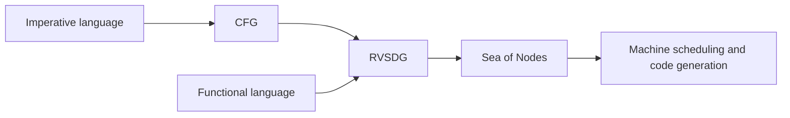
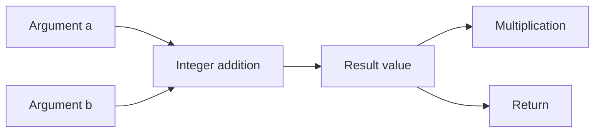
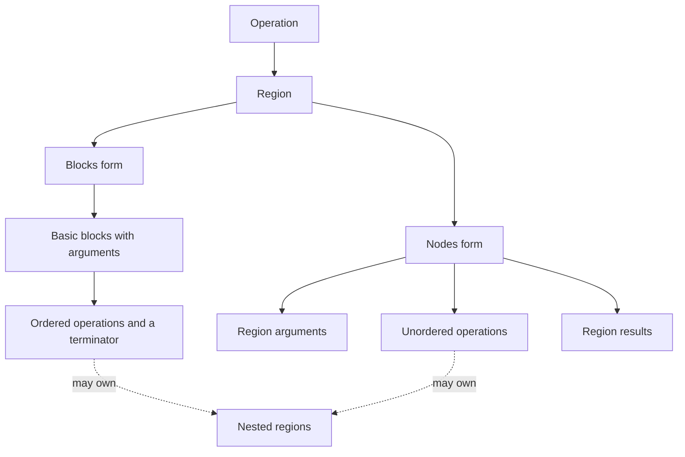
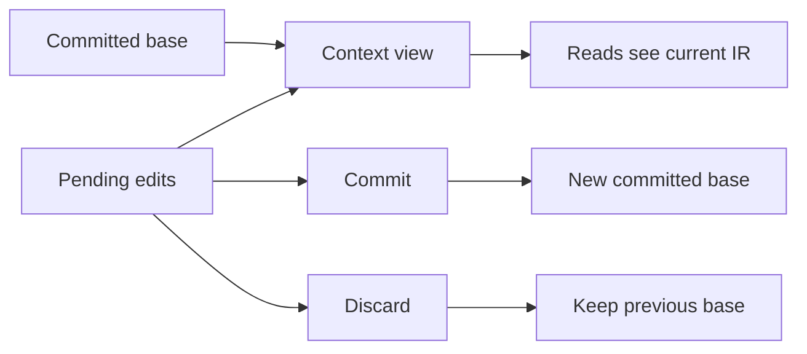

# Core IR

TIR's intermediate representation, or IR, describes a program as operations
connected by values. Operations can contain regions, so the same representation
can express a whole module, a function body, or a single instruction.

The core owns the graph and its editing rules. Dialects define what the
operations and types mean. This separation lets a compiler change the form of a
program without replacing all of its storage, traversal, and analysis machinery.

## Dialects

A dialect groups related operations and types under a name. For example,
`builtin` provides basic arithmetic and types, `func` describes functions and
calls, and `scf` describes structured control flow. Target dialects describe
machine instructions.

A dialect does not own a separate graph. Operations from several dialects can
appear in one function and exchange values. A dialect can also use types defined
by another dialect. Function operations, for example, can accept and return
builtin integer types.

Each operation definition gives the operation a name and describes its operands,
results, attributes, and nested regions. The definition can also declare type
constraints, interfaces, and formal semantics. Generated builders and accessors
give these parts names, such as the left and right operands of an addition.
Custom verification checks rules that the declaration cannot express.

The `dialect!` declaration lists a dialect's operations and types. An
`operation!` declaration defines an operation. Concrete types implement the
`Type` contract, including equality, hashing, parsing, and printing. The context
interns equal types so values can refer to them by a shared type ID.

Registering a dialect makes its parsers and operation interfaces available in a
context. Text such as `func.call` selects an operation through its dialect and
operation name. A typed operation object is a view of the common IR storage.
Edits through that view affect the same operation that generic graph traversal
sees.

A compiler pass examines or transforms the IR. Interfaces let a pass work with
behavior shared across dialects. A control-flow pass can ask whether an operation
is a terminator. A folding pass can ask whether an operation supports constant
folding. Neither pass needs a list of every dialect's operation names.

Formal semantics describe the computation an operation performs. For example,
integer addition describes its result in terms of its two operands. These
definitions support reasoning about equivalent computations and can supply
constant folding. They complement structural verification, which checks whether
the operation has valid inputs, outputs, and regions.

## Proposed flows

The following flows are a proposed organization for compilation. They describe
where each graph form is useful, rather than a required pipeline or a claim that
every transition is implemented.

### Imperative languages: CFG to RVSDG to SoN

A control-flow graph, or CFG, represents execution through basic blocks and
branches. Each block contains an ordered sequence of operations. Branches select
the next block and pass values to its arguments.

This form is a natural first representation for imperative languages. Source
statements have an order, mutable variables change over time, and jumps can
connect distant parts of a function. A frontend can preserve these relationships
while it resolves names, types, and storage.

A Regionalized Value State Dependence Graph, or RVSDG, expresses loops and
conditionals through nested regions. Values cross a region boundary through
inputs and outputs. State dependencies express the order of effects such as
memory access.

The CFG-to-RVSDG transition recovers this structure from branches. It must also
preserve effects before it removes block order. If a store must precede a load,
the resulting graph needs a dependency that preserves that order.

The [RVSDG and control flow chapter](rvsdg.md) describes the implemented
conversion, FCC's use of unordered regions, and reconstruction of machine
blocks after instruction selection.

RVSDG makes the inputs and outputs of a loop or conditional explicit. A
transformation can reason about one region, including the values it carries
between loop iterations, without reconstructing that boundary from jumps.

Sea of Nodes, or SoN, represents data, control, and effect dependencies as graph
edges. The proposed transition to SoN makes execution conditions explicit in the
graph as structured regions are lowered. Operations remain unscheduled where
their dependencies allow freedom. Later scheduling chooses legal blocks and
instruction positions.

The reason for this sequence is to keep useful structure until the compiler no
longer needs it. CFG preserves the frontend's execution order. RVSDG exposes
structured computation. SoN gives later transformations freedom to place work
subject to explicit dependencies.

### Functional languages: RVSDG to SoN

A functional frontend can start with RVSDG when expressions, function inputs,
conditional results, and recursion already provide useful boundaries. There is
no need to introduce a CFG merely to recover those boundaries later.

Pure expressions depend on their inputs. Effects still need state dependencies,
even when the source language is functional. The frontend must also preserve the
language's evaluation rules. A lazy language, for example, cannot treat every
expression as an eagerly evaluated node.

After the frontend makes those rules explicit, this flow joins the same proposed
SoN stage as the imperative flow.

### Graph form and dialect are separate choices

CFG, RVSDG, and SoN describe how a program is organized. A dialect describes the
meaning of its operations. Integer addition can keep its meaning across all
three forms, even when its placement or surrounding control flow changes.

TIR's core distinguishes regions of blocks from regions of unordered nodes.
An unordered region alone does not make a complete RVSDG or SoN. The operations,
region boundaries, and dependencies must express the rules of the chosen form.

## Core IR structures

### Context and identity

A `Context` owns the IR and its registrations. Operations, values, blocks,
regions, and types have IDs that identify them within that context. A handle
combines an entity's identity with access to its context.

Handles read the current state of an entity. Copying a handle does not copy an
operation or preserve an old version of it. An ID from one context is not a
portable reference into an unrelated context.

### Operations and values

An operation contains operands, results, attributes, and nested regions. Operands
refer to values that the operation consumes. Results are values that it defines.
Attributes hold information such as a constant literal or a comparison mode.
They do not create value dependencies.

TIR uses static single assignment, or SSA. Each value has one definition and a
type. The definition is either an operation result or an argument supplied at a
block or region boundary. A value can have many uses. If an operation reads a
value twice, those operand positions are two distinct uses.

Types describe values, while attributes describe operations and other IR
entities. A constant, for example, has a literal attribute and produces a typed
result value. Another operation consumes the result through an operand.

### Regions and blocks

Regions give operations nested bodies. A function owns its body region. A
conditional can own regions for its alternatives, and a loop can own a region
for its body. This creates a containment tree alongside the value dependency
graph.

A region has one of these forms at a time. In the blocks form, the entry block
provides the region's arguments. Terminators express control flow between
blocks or back to the enclosing operation. Block arguments receive values from
the incoming control-flow edges.

In the nodes form, the region has its own arguments, also called ports, and an
explicit list of results. Its operations have no execution order implied by
their position in storage. Value and state dependencies constrain execution.

The enclosing operation defines how its operands and results connect to its
regions. A loop, for example, relates initial values, body arguments, values
carried to the next iteration, and final results. Changing one of these lists
can require changes to the others.

### State dependencies

Ordinary values express data dependencies. State values express dependencies on
an effectful resource, such as memory. An operation that changes memory consumes
an incoming state and produces an outgoing state. A later access can depend on
that outgoing state.

This is necessary in unordered regions because textual position cannot preserve
memory order. Independent work can remain unordered, but removing a required
state dependency changes the program. State splits and joins must preserve the
resource's rules, including the order between reads and writes.

## Modification APIs and strategies

### Local edits

Typed builders create operations in a context. Placement is a separate choice.
In a block, an edit chooses an instruction position. In an unordered region, an
edit chooses a region and supplies the dependencies that constrain execution.

The context provides operations to change operands and attributes, replace uses,
replace operations, and erase operations. These APIs maintain graph bookkeeping,
including use lists, parent links, and change tracking. A transformation remains
responsible for the meaning of its edit and for compatible types and region
boundaries.

Replacing an operation requires a decision about its results. A replacement with
the same result shape can redirect consumers to corresponding new results. A
rewrite that changes the number or meaning of results needs an explicit mapping.
Some lowerings preserve result identities while transferring their definitions
to new operations.

Region outputs need attention too. A nodes region's result list is separate from
operation operands. Replacing operand uses alone does not update values exported
through that list. Similarly, removing an operation is safe only after its live
results have replacements or no longer escape to consumers.

### Edits to structured regions

An unordered operation belongs in a region where its operands are visible.
Automatic placement can infer that region from the operands, with state operands
constraining placement. An operation with no operands needs an explicit region.
Operands from sibling regions cannot become visible merely by moving their user.

Loops and conditionals have related inputs and outputs across their boundaries.
Port-editing APIs change these related lists together. Adding a loop-carried
value, for example, also needs its initial value, body argument, next-iteration
value, and final result. Treating these as one structural edit avoids a set of
unrelated list changes that happen to agree.

### Whole-region replacement

A change of graph form often replaces most of a region. Staging builds a new
body away from the attached body, then replaces the old contents as one
structural edit. The transformation records how surviving users reach the new
values.

This strategy suits changes such as rebuilding a CFG or converting between
blocks and nodes. Local edits suit small rewrites whose surrounding structure
stays useful. Staging avoids repeatedly exposing a half-rebuilt region to
traversal and analysis.

### Commit, discard, and parallel work

A context reads a committed base together with its pending edits. Each edit is
visible to later reads through that context. `commit` incorporates the pending
edits into the base, while `discard` drops the edits made since the last commit.

A frozen view shares the committed base without including pending edits. The
base can cross threads, while each editing context belongs to one thread.
Commit requires frozen readers to release the base first. Cloning an editing
context shares its edits, so it does not create an independent transaction.

Parallel passes use separate editing contexts over a shared base. They return
edit batches for a coordinated commit. The commit rejects overlapping writes to
the same existing entity. Work on separate functions is a useful way to keep
edits independent, provided those passes do not also change shared module data.

Commit is a storage boundary, not proof that a transformation preserved the
program. Change tracking lets analyses detect stale results, and verification
checks graph structure and dialect constraints. The pass still has to preserve
the computation and its effects.
