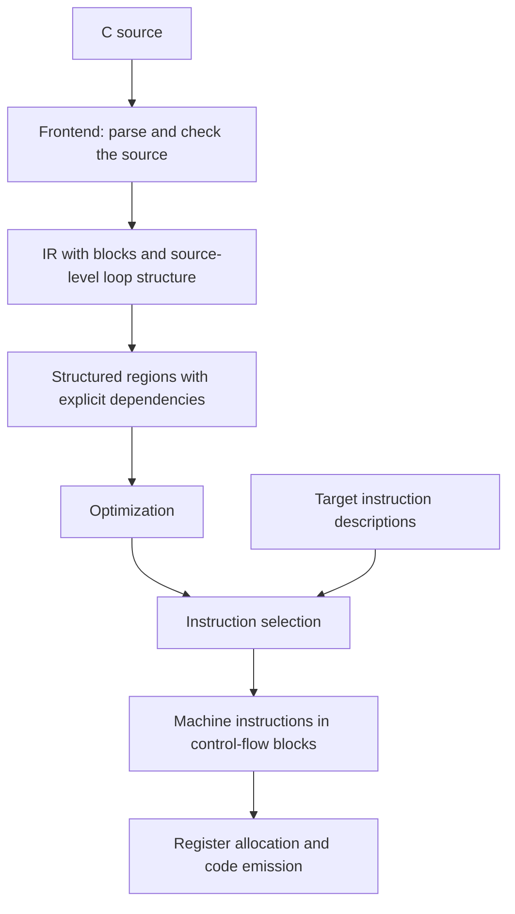

# TIR internals

TIR, short for Target Intermediate Representation, is a framework for building
compilers and tools that work with programs. Its central idea is a shared
intermediate representation, or IR. A frontend translates a source language
into this representation, transformations optimize it, and a backend turns it
into instructions for a target machine. FCC, the project's C compiler, is one
user of this framework.

This chapter introduces the parts of TIR and how they fit together. The linked
chapters explain each part in more depth.

## A shared representation

The IR describes a program as operations connected by typed values. An addition
consumes two values and produces another. A function contains a body, and a loop
contains the computation that repeats. These nested bodies are called regions.

Dialects give operations their meaning. A dialect is a family of related
operations and types, such as arithmetic, functions, structured control flow,
or a target's machine instructions. Several dialects can appear in the same
program. Compilation gradually replaces operations with forms closer to what
the target can execute.

The core provides the storage, editing rules, and common infrastructure for
these dialects. Interfaces describe behavior that transformations can recognize
across dialects. For example, a transformation can work with a loop through its
interface without knowing every dialect that defines loops.

There are two separate questions here: what does an operation compute, and how
is the surrounding program organized? Dialects answer the first. Graph forms
answer the second.

A control-flow graph, or CFG, organizes a function into ordered blocks connected
by branches. A Regionalized Value State Dependence Graph, or RVSDG, expresses
loops and conditionals through nested regions. Within an unordered region,
dependencies determine execution order. State values preserve the required order
of effects such as memory reads and writes.

The [Core IR chapter](core_ir.md) explains these concepts and their shared
representation. [RVSDG and control flow](rvsdg.md) explains how TIR moves between
blocks and structured regions.

## A program's path through TIR

FCC gives a concrete example of how the pieces work together. This diagram
groups the main responsibilities rather than listing individual passes.

The frontend owns source-language rules, such as what names refer to and which
types an expression permits. Once it expresses those rules in IR, shared
transformations can work on the program without understanding C syntax.

Structured regions expose the inputs, outputs, and dependencies of loops and
conditionals. Optimizations use that information to simplify computations and
change loop execution while preserving the program's results and effects.

Instruction selection chooses target instructions for those computations.
TIR then reconstructs machine blocks and orders their instructions according to
dependencies. Register allocation assigns values to physical registers, and
final lowering and encoding produce machine code.

Other clients can enter TIR at different stages. The framework's shared IR and
transformations do not require every tool to follow FCC's pipeline.

## Descriptions drive transformations

TIR favors explicit descriptions of computations and transformation rules.
Shared algorithms use those descriptions to explore alternatives and choose
legal results.

[PDL](../pdl/index.md) describes rewrite patterns and their replacements. These
rules express changes to computations without each rule needing its own graph traversal.
For instruction selection, an e-graph keeps equivalent expressions available
together, so choosing one expression early does not hide another useful form.
The selector matches target instructions against these alternatives and uses
costs and compatibility constraints to choose a set of instructions.

Loop optimization uses a different model. Affine transformations describe loop
iterations and their dependencies mathematically. Where a loop fits that model,
the compiler can change iteration order or group iterations into tiles while
respecting those dependencies. [Affine loop optimization](affine.md) explains
the iteration model, dependence checks, and schedule selection.

TMDL, the TIR Machine Description Language, describes target instructions,
including their operands, encodings, and behavior. Instruction selection connects
the meaning of IR operations to these instruction descriptions. The same
descriptions also support tools such as assemblers, simulators, and verification.
Formal semantics make such reasoning possible, but do not mean that every
compiler transformation has a proof of correctness.

The [Instruction combining chapter](instcombine.md) explains how shared rules
simplify computations before machine instructions are chosen.
The [Instruction selection chapter](isel.md) follows the choice of machine
instructions. The [TMDL overview](../tmdl/index.md) introduces the language used
to describe them.

## Where things live

The repository separates language-specific work, shared compiler machinery,
and target-specific work.

| Area | Responsibility |
| --- | --- |
| `fcc/` | The C frontend, C-specific IR and transformations, and compiler driver. |
| `core/` | Shared IR, common dialects, analyses, transformations, and backend algorithms. |
| `backends/` | Machine targets, including instruction descriptions and target-specific lowering. |
| `gpu/` | Virtual GPU instruction sets and shared GPU support. |
| `tmdl/` | The compiler and tooling for machine descriptions. |
| `utils/` | Reusable algorithms and supporting tools, including symbolic reasoning, PDL, solvers, and testing infrastructure. |
| `tools/` | Command-line tools for working with IR and machine code. |
| `simulator/` | Instruction simulation and its shared runtime. |

Shared backend algorithms belong to the core, while a target supplies its
instruction set and machine-specific rules. Likewise, the C frontend uses the
core's IR but keeps C-specific behavior in FCC. These boundaries let new
languages and targets reuse the same compiler machinery.

For a first read, start with [Core IR](core_ir.md), then follow
[RVSDG and control flow](rvsdg.md) into [Instruction combining](instcombine.md)
and [Instruction selection](isel.md).
For target work, read the [TMDL overview](../tmdl/index.md) alongside instruction
selection. The [Developer's Guide](../dev_guide.md) covers building, testing,
and working on the repository.
