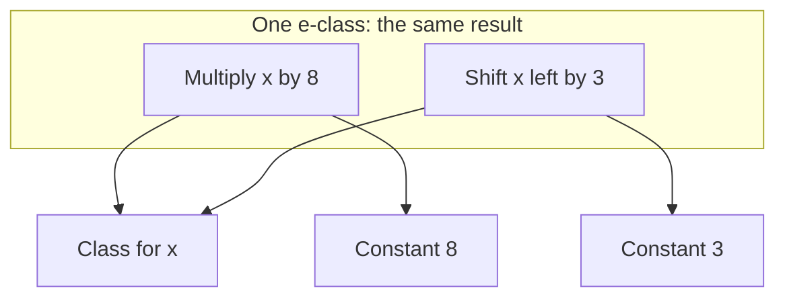
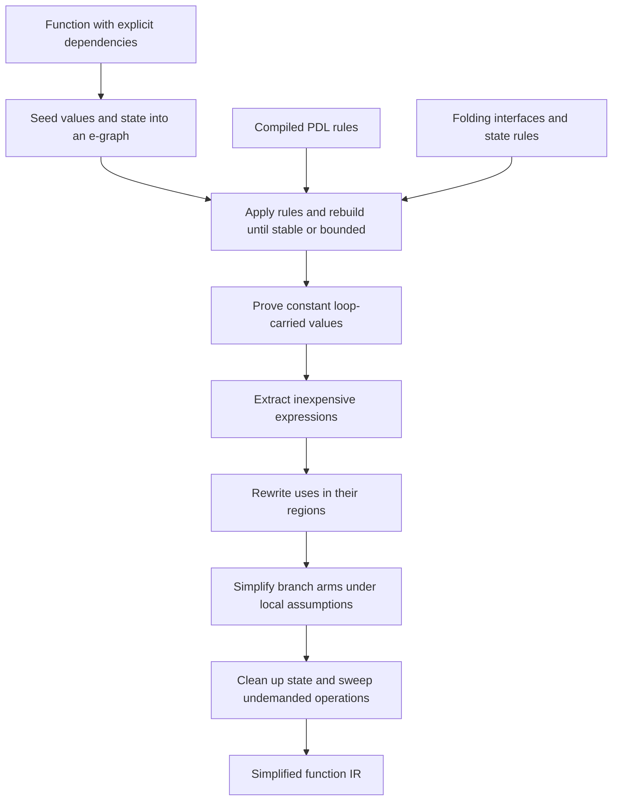
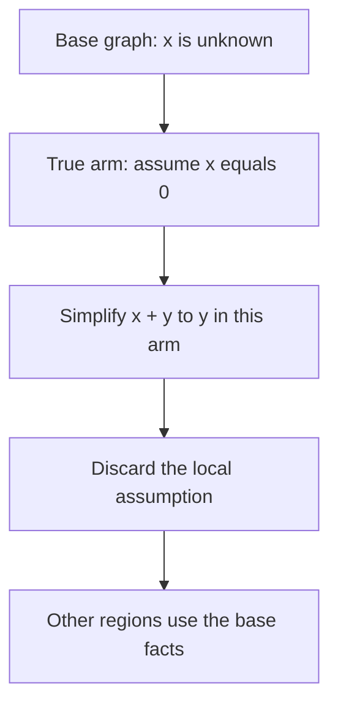

# Instruction combining

Instruction combining simplifies a program's computations before instruction
selection chooses machine instructions. It removes identities such as adding
zero, folds constant expressions, and replaces expensive expressions with
cheaper equivalents. In TIR, it can also use facts from branches, loops, and
memory dependencies.

The name describes the purpose, not a requirement to combine two instructions
into one. A useful result might be an existing value, a constant, or a different
operation. The pass works on compiler IR rather than processor instructions.

TIR's instcombine engine uses an e-graph to retain equivalent expressions until
it chooses a result. [PDL](../pdl/index.md) describes many of the equalities.
The engine supplies the search, cost comparison, control-flow reasoning, and
IR updates that make those rules useful.

## The input and output

An IR operation consumes values and produces results. A region contains
operations, and an operation can contain regions for branch arms or loop
bodies. In an unordered region, dependencies determine execution order.
State values express dependencies between effects, such as a store and a
subsequent load. The [Core IR](core_ir.md) and
[RVSDG and control flow](rvsdg.md) chapters introduce this representation.

Instcombine works on functions in this unordered form. Its output is still
IR in the same form, with uses redirected to simplified values and operations
removed when nothing demands their results or effects. It does not assign
registers or schedule machine instructions.

The pass can run more than once in an optimization pipeline. For example,
inlining can expose constants, and loop transformations can expose address
arithmetic. Each invocation reasons about the function it receives.

## Equivalent expressions share a class

An e-graph stores expressions in equivalence classes, usually called e-classes.
An e-class groups expressions known to produce the same value. An expression
node records an operation and refers to its inputs through other e-classes.
Those input classes can themselves contain several alternatives.

Suppose a rule establishes that multiplication by eight equals a left shift
by three. The graph can retain both forms:



Adding the shift does not immediately delete the multiply. Other rules can
match either form. The engine commits to a representation only when it
extracts an expression from the graph.

Equality also propagates to parents. If two inputs become equivalent, two
otherwise identical operations over those inputs become equivalent too.
This property is called congruence. Rebuilding the graph restores it after
rules merge classes.

The graph is not a syntax tree. Different expressions can share inputs, and
equalities can introduce cycles. For example, equating `x + 0` with `x` can
leave an addition whose child refers back to its own class. Extraction must
find a finite representation rather than follow that cycle forever.

## From a function to a simplified function

The engine separates discovering alternatives from changing the IR:



### Seeding preserves identity and dependencies

Seeding gives each IR value an e-class. Constants become constant nodes.
Representable operations become nodes over the classes of their inputs.
Operation metadata supplies facts such as commutativity and modeled cost.

The graph also records where a node came from. An existing IR value can often
be reused directly. A rule-created expression needs a way to construct a new
IR operation. A literal needs a constant operation of the appropriate type.
This origin information connects graph exploration to the later IR update.

An operation that the graph cannot represent remains an opaque input. The
engine preserves its identity, so other expressions can refer to it without
assuming anything about its implementation. This allows partial knowledge:
an identity such as `x + 0 = x` does not require understanding how `x` was
computed.

Structured branches contribute conditional values. Loops contribute their
carried inputs, backedges, and published results. Memory accesses contribute
terms tied to the state they observe. These relationships come from the IR's
operation interfaces and dependencies.

### Rules discover equalities

The ruleset combines PDL equalities with rules supplied by the host engine.
PDL is useful for local expression patterns:

```pdl
rule add-zero: builtin.addi(x: int<W>, 0) => x;
rule mul-pow2-to-shl:
	builtin.muli(x: int<W>, c: const) => builtin.shli(x, const<W>(ctz(c)))
	where popcount(c) == 1, c != 1;
```

The first rule equates an addition with its first operand. That operand can
be any integer value, including zero. The second checks a constant
and introduces a shift. Neither rule traverses the function or edits users.

Host rules connect matching to behavior that an operation already provides.
Constant folding, for example, asks an operation to compute its result from
constant inputs. Other rules handle known branch decisions and memory state.
The shared engine executes these rules alongside the PDL rules.

### Relational queries drive matching

A compiled pattern is a query over graph nodes and facts about classes.
Each operation in a nested pattern contributes a relation to match. Repeated
binders join those relations through the same class. Guards filter candidate
bindings or compute scalar values needed by the replacement.

For an expression such as `(x + y) - y`, the query joins a subtraction node
to an addition node and requires both appearances of `y` to name the same
class. A successful match can merge the subtraction's class with `x`.

A saturation round searches the current graph, collects matches, applies
their actions, and rebuilds congruence. Later rounds use recorded changes to
restrict searches where a rule's dependencies permit that restriction.
This avoids treating every rule as a fresh whole-function traversal.

The rounds stop when no further progress is found or when a resource limit
is reached. Bounds on work and graph size keep compilation finite even when
the rules can generate many alternatives. The result therefore contains the
equivalences discovered within the search budget, not every possible identity.

Some rules run in a terminal post-saturation phase. Constant reassociation is
one use: a new constant should not repeatedly feed a cyclic class and generate
more constants in the same saturation call. These rules have the same equality
obligation as ordinary rules; only their scheduling differs.

## Facts that hold only inside a region

A condition can be unknown for the function as a whole but known inside one
of its branch arms. The engine opens an assumption scope for a boolean arm,
equates its predicate with the appropriate truth value, and saturates again.
If the condition establishes an equality between operands, their classes can
also merge inside that scope.

For example, inside the true arm of `x == 0`, an expression `x + y` can simplify
to `y`. That does not establish `x == 0` after the branch or inside its false
arm.



The scoped graph and its extraction results keep these facts local. Values
constructed using an arm's assumptions are not reused as if the assumptions
held everywhere.

## Constant values carried through loops

A loop-carried value receives an initial value on entry and a new value from
each backedge. A constant initial value alone does not make it constant
throughout the loop.

The engine tests that possibility as a hypothesis. It temporarily equates a
candidate carried value with its initial constant, saturates the body under
the hypotheses, and checks every backedge. If a backedge is not equal to the
initial constant, the candidate is removed. The engine repeats with the
remaining candidates until none are refuted.

This is an inductive argument: the value is constant on entry, and the body
preserves that constant on every next iteration. Only surviving hypotheses
become facts in the enclosing graph. Nested loops are considered in their
enclosing assumption scope, so a proof that depends on an outer hypothesis
does not escape it prematurely.

This mechanism discovers constant carried values. It is not a general solver
for arbitrary loop invariants or a license to unroll loops in rewrite rules.

## Cost guides extraction; scope constrains placement

Extraction chooses finite expressions with low modeled cost. An operation's
cost combines with the costs of its inputs. Constants have no computation
cost in this model. Opaque or structural forms remain available when no
better representation is known.

These costs guide simplification. They do not model an entire processor,
register allocation, or every consequence of sharing computations. The
[instruction selector](isel.md) makes later target-specific choices.

An inexpensive graph expression is useful only if the IR can express it at
the consumer. The update therefore checks region visibility. A value defined
in the consumer's region or an enclosing region can be reused. A value from
an unrelated arm cannot simply be referenced there.

An existing operation can be recreated elsewhere only when its behavior allows
that speculation and its inputs can be made available. Potential traps matter:
moving a division out of a condition can execute it on a path where it never
ran before. If the chosen expression cannot be materialized safely, the
engine preserves the existing computation.

For new expressions, typed emitters construct the actual IR operations.
Memoization shares a materialized value among readers that can see it.
Uses and region results are redirected only after a usable replacement exists.

## Memory simplification and demand

Memory state makes ordering part of the expression being simplified. A load
depends on the state it observes. A store contributes the state it produces.
A load from the location just written can use the stored value when the
memory rule establishes the same object, offset, access size, and required
access properties.

Pointer facts help establish those relationships. Derived addresses retain
their base object and offset when the graph can determine them consistently.
Unknown or conflicting information does not establish that two accesses
refer to the same location.

Replacing a load's value also requires repairing its state dependencies.
Likewise, removing an unread write is a question about which effects the
remaining program demands, not an arithmetic equality between values.
The IR update handles that cleanup after expression choices have been made.

A disjoint read can observe the state before an overwritten store without
changing its value. The commit compares the two access extents, requiring the
same object and nonoverlapping ranges with positive byte counts. It accepts a
single read or a fork of reads that reconverges at one join, and requires the
continuation to reach a write of the original extent. Only then does it bypass the old
store. The reads keep their output states and join, so the surviving write
still depends on them. The final sweep erases the old store before state-fork
verification. Unknown extents and other fork shapes keep the store.

The final sweep starts from region results and follows both value and state
dependencies. An operation remains when the program demands its result or
effect. A loop that changes observable memory remains demanded through its
state even when none of its ordinary value results are read.

## PDL's boundary with the engine

Instcombine's PDL rules compile into Rust during the build. The generated
code constructs match queries, guards, and graph actions. Rules that introduce
operations also connect to typed IR emitters. No PDL parser runs for each
function being optimized.

The engine owns equivalence classes, search, scoped assumptions, extraction,
and IR updates. PDL owns the expression relationships written as rules.
Operation interfaces supply behavior such as folding and speculation safety.
Keeping these responsibilities separate lets one new identity use the same
matching and placement machinery as the existing rules.

An equality rule remains a correctness claim by its author and its proof
mechanism. Successful parsing and bounded saturation do not prove it.
Floating-point rounding, traps, and effects can invalidate identities that
hold for mathematical integers. Directional, contract-governed changes belong
to PDL refinements rather than unconditional e-class merges.

The [PDL reference](../pdl/reference.md) describes rule syntax, proof modes,
and the subset supported by generated instcombine rules.
