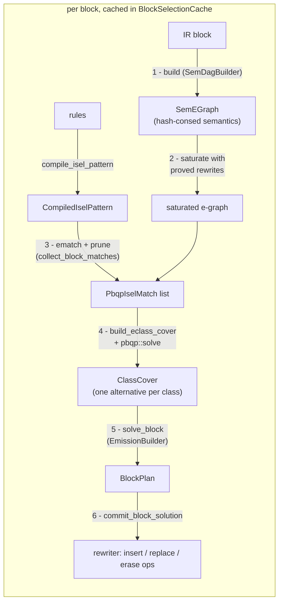

# Instruction Selection

Instruction selection (`backends/common/src/isel/`) turns target-independent IR
into target instructions. It is **e-graph + PBQP**: each basic block is lowered to
a semantic e-graph, saturated with proved algebraic identities, tiled against the
target's instruction patterns, and the cheapest legal cover is found by solving a
Partitioned Boolean Quadratic Problem (PBQP).

Nothing in the pass hardcodes a semantics, cost, or rule. A target supplies a list
of `Rule`s (a semantic pattern + an emitter) and an optional cost model; the pass
does the rest.

## Module layout

| module | responsibility |
|--------|----------------|
| `isel/mod.rs` | public API (`Rule`, `EmitRequest`, cost-model traits), the pass driver and per-block cache |
| `isel/node.rs` | the `SemNode` label, `SemPayload`, and e-class helpers (`class_binding`, widths) |
| `isel/builder.rs` | `SemDagBuilder`: IR ops → semantic e-graph, including memory effects |
| `isel/pattern.rs` | `compile_isel_pattern`: rule semantics → matchable `Pattern`s |
| `isel/rewrites.rs` | discovery of proved algebraic rewrites (`discover_rewrites`) |
| `isel/cover.rs` | PBQP construction, match dominance pruning, completeness check |
| `isel/emit.rs` | `BlockPlan` and `EmissionBuilder`: cover → per-op decisions |

## Pipeline



The pass runs per function. The first op it visits in a block triggers
`commit_block_solution`, which builds and solves the **whole block** at once
(`emitted_blocks` guards against re-emitting). Results are memoized in
`block_cache` keyed by `BlockId`, so building and solving each happen once.

## 1. Building the semantic e-graph

`SemDagBuilder` lowers every op in the block into one shared
`SemEGraph = EGraph<SemNode, ()>`. There is no separate DAG arena: the e-graph
hash-conses, so it *is* the interned semantic DAG, and identical sub-expressions
across ops collapse to one e-class (CSE for free).

### What a node is

An e-node is a **label** plus its **operand e-classes**. The label is a
`SemNode`:

```rust
struct SemNode { kind: ExprKind, payload: Option<SemPayload>, ty: Option<TypeId> }

enum SemPayload {
    Expr(ExprPayload), // a semantic constant / symbol / value
    Opaque(u32),       // a unique, never-merging marker (see below)
}
```

Structure (the operands) lives in the e-node's child classes, never in the label.
So two e-nodes are congruent iff they share a label *and* the same operand classes
— exactly what `PartialEq`/`Hash` compare. `ty` is the verbatim IR type (no width
normalization), so every target can constrain on the widths it distinguishes.

```
   add : i32                       a SemNode label is just (kind, payload, ty);
   ┌──────────┐                    operands are edges to child classes
   │ kind=Add │
   │ ty =i32  │ ──┬──► class[x]    (symbol, ty=i32)
   └──────────┘   └──► class[y]    (symbol, ty=i32)
```

`ExprKind` / `ExprPayload` come from each op's `semantic_expr` (the sem-DSL), so a
multi-node expansion (e.g. a load becomes `LoadMemory(add(addr, 0), bytes,
meta)`) lands as several e-nodes.

### Opaque payloads: things that must never merge

`SemPayload::Opaque(serial)` makes a node label unique, defeating hash-consing
and saturation's congruence repair, while still matching any untyped pattern
node of the same kind (a pattern payload of `None` is a wildcard). It is used
for:

- **un-lowerable sub-expressions** (`add_opaque`): two unknown computations are
  never assumed equal;
- **memory effects and their addressing wrappers** (`add_op_unique`): loads are
  not pure values (two loads of one address differ across an intervening
  store), so their e-classes must never merge; the synthetic `addr + 0`
  wrapper stays private to one memory op for the same reason.

### Memory ops

Ops implementing `MemoryRead` / `MemoryWrite` are lowered by
`build_memory_effect` into `LoadMemory` / `StoreMemory` nodes whose address is
wrapped as `addr + 0` so the targets' base+offset addressing patterns
match a bare pointer. The interfaces are the only trigger; there is no op-name
matching.

### Branch effects

`build_branch_effect` lowers an `asm.condbr` (see [Control-flow
selection](#control-flow-selection)) into a `CondBranch` node over its
condition. Like a memory effect it is `add_op_unique` (never merges) and
non-pure (`class_is_pure` excludes it), so it roots a match and is never
internalized. The branch target is an op attribute, not a value, so it never
appears in the expression.

### Side tables produced by the build

| table | meaning |
|-------|---------|
| `op_by_root: EClassId → OpId` | the **earliest** op whose result the class produces |
| `op_root: OpId → EClassId` | every op's canonical root class (total, unlike `op_by_root`) |
| `class_value: EClassId → ValueId` | the IR value a class computes (so an interior result can be re-materialized as a register) |
| `shared_classes: Set<EClassId>` | a value used as an operand by **>1 consumer**; a memory effect here can never be internalized into a larger match (a pure value still can — duplication) |
| `must_materialize: Set<EClassId>` | an op-root class whose value is used by an op no match reaches (return, branch, un-lowered, another block); it is never offered a consuming alternative |

When saturation merges two value-carrying classes (the values are provably
equal), both maps deterministically keep the **earliest-defined** op/value: it
dominates every later use in the block.

## 2. Saturation with proved rewrites

Before tiling, the e-graph is saturated with target-independent algebraic
identities (`self.rewrites`). These are **not** hand-written selection rules — they
are bit-vector lemmas the target's own instructions happen to realize.

`discover_rewrites` finds them: if the target has an atomic `slli` plus the
matching right shift, it confirms the standard shift-pair extension identity
against a `FuzzOracle` and emits a width-parameterized rewrite:

```
   SExt(v, W)   ──rewrite──►   ShiftRightArithmetic( ShiftLeft(v, W-n), W-n )
                                                            with n = width(v)
```

After `egraph.union`, the `SExt` class *also contains* the shift-pair form, so a
target with no sub-word sign-extend instruction can still cover it via shifts. The
introduced shift nodes are untyped, so they match width-agnostic shift patterns.

> Saturation may merge classes, so `op_by_root` and `class_value` are
> re-canonicalized through `egraph.find` afterwards (earliest definition wins,
> see §1).

## 3. Patterns and matches

Each `Rule`'s pattern is compiled once (`compile_isel_pattern`) into a
`Pattern<SemNode>`. Operand leaves become **Boundary** nodes (capture points,
recorded in `boundary_symbols`); interior nodes become typed/untyped `Node`s.
`specificity` counts type-constrained nodes — the tie-breaker (see below).

`collect_block_matches` ematches every pattern against the saturated e-graph,
producing a `PbqpIselMatch` per hit:

```rust
struct PbqpIselMatch {
    pattern_index, rule_index,
    root: EClassId,           // class this match would compute
    pattern_root: NodeId,
    bindings: FullMatchBindings,  // pattern_node → class, + symbol → class captures
    cost: u64,                    // the cost model's node cost, unmodified
}
```

A match rooted at a pure operand (leaf/constant) is discarded — instructions root
at *computed* values only. A pure class may sit interior to any number of
matches (each fused instruction recomputes it); a shared *memory effect* (§1)
is allowed as a match root or boundary, but never as an interior node a larger
match would erase.

### Dominance pruning (specificity)

Before the solve, `prune_dominated_matches` deduplicates interchangeable
matches: among matches with the same root class, the same internal-class
coverage, and the same boundary operands, the one that is no cheaper *and* no
more specific is dropped. So at **equal cost** the type-constrained rule wins
(an `i32 addw` beats the untyped `add`), while a genuinely cheaper instruction
still wins on cost alone — and specificity never distorts the PBQP objective.

## 4. The PBQP cover

`build_eclass_cover` maps the tiling problem onto PBQP: **one PBQP node per
e-class**, each offering a set of **alternatives**:

```
   PbqpIselAlternative
   ├─ External                       leaf, or a value materialized in a register
   ├─ Root { match_id }              this class is the instruction's result   ← cost lives here
   └─ Internal { match_id, p_node }  this class is an interior node of that match (cost 0)
```

Only the **Root** alternative carries the match's cost; interior nodes are free
(the paper's convention). A match's root and its *memory-effect* internals are
held together by a **coherence set**; pure internals are exempt — the
instruction recomputes them (duplication), so the match stays selectable even
when the class is claimed by another match or materialized in its own right.
Classes in `must_materialize` are never offered Internal alternatives at all.

Edges connect each match's **root class to every class the match binds**, so
the match's requirements don't depend on the choices of intermediate pattern
nodes. The compatibility matrix sets `INF_COST` for incoherent pairs and asks
`alternatives_compatible` (via `child_requirement`):

```
   parent Root/Internal expects a class its match binds to be …
   ├─ Materialized   (bound under a Boundary)  → child must be Root or External
   ├─ SameMatch      (a memory-effect interior node) → child must be exactly
   │                                                    that Internal{match,node}
   └─ nothing        (a pure interior node) → any choice; the instruction
                                              recomputes the value (duplication)
```

`pbqp::solve` returns the min-cost assignment as a `ClassCover` (one chosen
alternative per class).

### Worked example: `square` lowering

`extsi(addi(a, b) : i16) : i64` with RV-style rules `add`, `slli`, `srai`:

```
  build + saturate                        cover                       emit
  ─────────────────                       ─────                       ────
  Add(a,b) : i16   ◄── op_by_root         Root: add        ─────────► addi
       │                                                                │
  SExt(·, 64): i64 ◄── op_by_root         class also holds            (interior
       │  saturate adds ▼                 srai(slli(·,48),48)          slli has
  ShiftRightArith( ShiftLeft(·,48), 48)   Root: srai                   NO op →
              ▲ introduced (no op)        Root: slli (introduced) ───► introduced
                                                                        emit before
                                                                        srai)
                                          ──────────────────────────► addi, slli, srai
```

The `slli` e-class came from saturation and backs no original IR op, so the
`EmissionBuilder` materializes it as a fresh-valued instruction inserted *before*
its consumer (an `IntroducedEmit`).

## 5. Planning emission

`solve_block` reads the cover into a `BlockPlan`:

```rust
struct BlockPlan {
    op_decisions: HashMap<OpId, BlockDecision>,   // Emit{rule,match} | Consume
    introduced: Vec<IntroducedEmit>,              // operand-first order
}
```

- A class chosen **Root** and backed by an op → `Emit` that op with the rule.
- A class chosen **Internal** and backed by an op → `Consume` (erased; folded into
  its parent instruction).
- A **Root** class with no backing op → an `IntroducedEmit` (the saturation `slli`).

`EmissionBuilder::resolve_match` turns a chosen match into a concrete
`RuleMatch` — the symbol→operand bindings the emitter reads. Operand resolution
order (`class_binding`): introduced fresh value → constant immediate → input value
→ intermediate result value.

`completeness_error` runs **before** solving: every non-terminal op-root class must
be a Root or interior of *some* match, else selection fails naming the unsupported
`ExprKind` ("missing atomic materializer rule for semantic kind …"). This is how an
incomplete rule set is rejected instead of silently dropping an op.

## 6. Committing

`commit_block_solution` applies the plan through the `Rewriter`:

1. Insert each `IntroducedEmit` before its anchor (operand-first). Its
   `EmitRequest` carries only the fresh destination value (`op: None`).
2. For each original op, in **reverse block order** (consumers before defs, so
   a def's `replace_op` use-remapping sees every already-emitted consumer):
   `replace_op` (Emit) or `erase_op` (Consume).
3. Drop `constant` ops left dead — an immediate folded into an instruction
   attribute detaches the constant's only use, so the maintained def-use chain
   reports zero uses and it is erased.

## Control-flow selection

Conditional branches are selected through the same cover as every other op,
rather than by hand-written per-target lowering. The key idea: a branch's
**condition** is an ordinary value the e-graph can fuse, and its **target** is
an op attribute the emitter copies — so the only new node is `CondBranch`, an
effect that roots a match (§1, *Branch effects*).

### CFG split

A two-way `builtin.cond_br %c, ^t, ^f` does not map to one machine
instruction, so a target-independent pre-selection pass
(`backends/common/src/cfg.rs::split_cond_branch`) rewrites it into:

```
   asm.condbr %c, ^t      ; conditional, falls through otherwise
   br ^f                  ; the not-taken edge, an ordinary unconditional branch
```

`asm.condbr` is deliberately **not** a `Terminator` — it sits mid-block, ahead
of the block's real terminator (the `br`). The not-taken edge is always an
explicit jump (no fall-through layout dependence); a later pass can drop
redundant jumps. A target opts into the split via `pre_isel_lowerings`, so it
runs only once that target has `asm.condbr` rules. Block arguments on branch
edges are not yet supported and are rejected here.

### Generated branch rules

`rustgen` derives the rules from each branch instruction's own behavior
(`if COND { PC::pc = … }`), with no hand-written selection rule:

- **Fused (compare-and-branch).** Pattern `CondBranch(COND)` where `COND` is the
  branch's predicate over its operands. RISC-V `beq`'s `if rs1 == rs2` →
  `CondBranch(Eq(rs1, rs2))`. A `cmpi` feeding the branch lowers to the same
  `Eq`/`Lt`/… node (`cmpi` supplies a `custom_semantic_expr` mapping its
  predicate to an `ExprKind`), so the comparison is consumed and a single
  `blt`/`beq`/… is emitted.
- **Branch-if-nonzero.** For a `!=` branch whose operand class has a
  `hardwired_zero` register (RISC-V `x0`), an extra rule with pattern
  `CondBranch(Boundary)` matches a bare i1 condition and emits `bne cond, x0`,
  wiring the second operand to the zero register. It costs one more than the
  fused form, so a real comparison still prefers compare-and-branch.

The emitter reads the target block from the `asm.condbr`'s `dest` attribute off
the op being replaced; condition operands come from the match bindings as usual.

### Future: flag-based branches (AArch64 NZCV)

The model above assumes the branch's condition is expressed over its operands
(compare-and-branch ISAs: RISC-V). AArch64 instead branches on **NZCV flags**:
`b.lt` is `if PSTATE::n != PSTATE::v { … }`, and the comparison lives in a
separate `cmp`/`subs` that writes the flags. `b.eq`/`b.lt`/`b.ne` are therefore
*identical in shape* (`CondBranch(<flag read>)`) and indistinguishable without
modeling the flags. Supporting them needs three pieces, none of which the
current infra provides:

1. **Flag-lemma rewrites.** A `b.cc`'s behavior never mentions the compared
   operands, so no rule is derivable from it alone. The equivalences
   (`Lt(a,b) ≡ Ne(N(a,b), V(a,b))` with `N=sign(a−b)`, `V=sovf(a−b)`, and the
   `eq/ne/lo/hs` analogues) must be **discovered** by composing `cmp`'s flag
   definitions with each predicate via the `FuzzOracle`/`EquivalenceOracle`,
   then added as saturation rewrites so a comparison class also holds its flag
   form (mirrors `discover_rewrites` for the shift-pair extension lemma).
2. **A multi-output, multi-operand definer.** `cmp` writes all four flags from
   *two* operands. Today's `RegisterDefiner` is single-register / single-value
   (it backs `vsetvli → vl`), and `rustgen` gives multi-write instructions no
   rule at all. The `N` and `V` reads in `b.lt` must both resolve to the *same*
   introduced `cmp(a,b)`; the definer must recover `a,b` from the matched flag
   sub-expressions.
3. **Cost modeling** of the two-instruction `cmp; b.cc` sequence so the cover
   weighs it against alternatives.

The bare-i1 AArch64 form (`cmp cond, xzr; b.ne`) hits the same blockers — it,
too, needs a flag lemma plus a flags-definer — so there is no cheaper AArch64
slice that reuses the RISC-V path. Until this lands, AArch64 keeps its
hand-written branch lowering (`lower_vcond_br` / `finalize_virtual_ops`) and
does **not** install `pre_isel_lowerings`.

## Cost model

A target may install an `IselCostModel` (`with_cost_model`); its single hook,
`node_cost(context, op, rule, match)`, prices the Root alternative of an
op-backed match. The default is the rule's TMDL-derived `base_cost`, which is
also what a rewrite-introduced match (no backing op) always costs. Costs enter
PBQP unmodified; equal-cost ties between interchangeable matches are resolved
by dominance pruning (§3), not by cost tweaks.

## Emitters

Each rule's emitter is
`fn(&Context, &EmitRequest, &RuleMatch) -> Result<Box<dyn Operation>, PassError>`:

```rust
struct EmitRequest<'a> {
    op: Option<&'a OperationRef>, // None for a rewrite-introduced instruction
    results: &'a [ValueId],       // destination values
    result_ty: Option<TypeId>,
}
```

By convention an emitter writes its destination *into the original result
`ValueId`* (TMDL-generated emitters store it as the destination register
attribute), so consumers and later passes keep referencing the same values.
`replace_op` only rewrites SSA uses when the old and new ops declare the same
number of results; machine ops declare none, so the original values stay live
and the Def-role register attribute claims their def-site.

## Key types at a glance

| type | role |
|------|------|
| `SemNode` | e-graph label: `(kind, payload, ty)` |
| `SemDagBuilder` | lowers a block's ops into the e-graph |
| `Rule` | a target's pattern + emitter + base cost + operand constraints |
| `CompiledIselPattern` | a rule's pattern compiled for ematch, with boundary symbols + specificity |
| `PbqpIselMatch` | one ematch hit: root class, bindings, cost |
| `BlockSelectionCache` | per-block memo: egraph + side tables + solved plan |
| `BlockPlan` / `IntroducedEmit` | the emission plan and its synthesized instructions |
| `EmissionBuilder` | turns a cover into per-op `RuleMatch`es, materializing introduced classes |
| `EmitRequest` | what an emitter writes into: backing op (if any) + destination values |
| `IselCostModel` | target hook for match cost (`node_cost`) |
