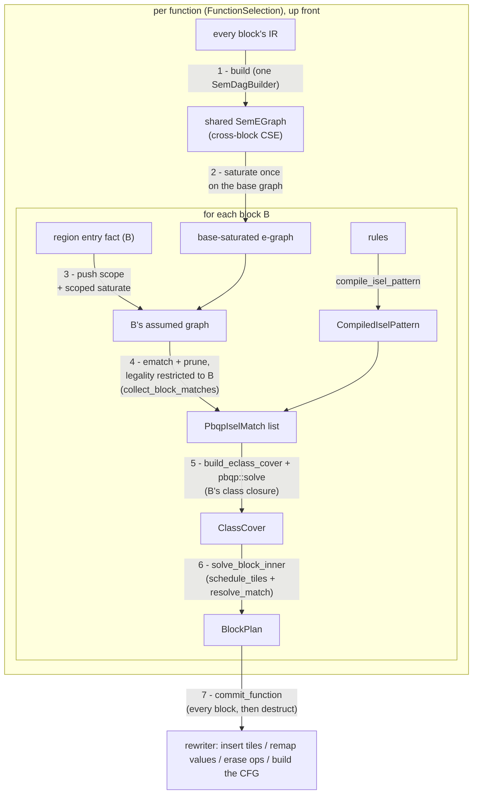

# Instruction Selection

Instruction selection (`core/src/backend/isel/`) turns target-independent IR
into target instructions. It is **e-graph + PBQP**: the whole function is lowered
into one shared semantic e-graph, saturated with proved algebraic identities, and
tiled against the target's instruction patterns; each block is then covered
*separately* — the cheapest legal cover found by solving a Partitioned Boolean
Quadratic Problem (PBQP) — inside an assumption scope carrying the entry facts of
the regions that enclose it.

Nothing in the pass hardcodes a semantics, cost, or rule. A target supplies a list
of `Rule`s (a semantic pattern + an emitter) and an optional cost model; the pass
does the rest.

## Module layout

| module | responsibility |
|--------|----------------|
| `isel/mod.rs` | public API (`Rule`, `EmitRequest`, cost-model traits), the pass driver, the shared `FunctionSelection`, and per-block solving |
| `sem/node.rs` | the `SemNode` label and `SemPayload` — the vocabulary |
| `sem/egraph.rs` | `SemEGraph` and the vocabulary's e-class readings (`class_int_binding`, widths, IR↔semantic types) |
| `isel/node.rs` | what selection reads beyond that: low-bit register views, `class_value_binding`, `class_register_type` |
| `isel/builder.rs` | `SemDagBuilder`: the function's IR ops → one shared semantic e-graph, including memory effects and the structured operations' own control (`build_region_control`) |
| `isel/pattern.rs` | `compile_isel_pattern`: rule semantics → `tir_relational` query plans + per-node metadata |
| `sem/axioms.rs` | s-expression axioms and their compilation into proved rewrites |
| `defs/isel.sexp` | checked target-independent semantic invariants |
| `sem/rewrites.rs` | theory-family selection and saturation driver |
| `isel/matches.rs` | `Matches`: the function's value matches in columns, indexed by root class, with one frame per open assumption scope |
| `isel/cover.rs` | PBQP construction, match dominance pruning, completeness check |
| `isel/emit.rs` | `BlockPlan`: cover → an ordered tile schedule (`schedule_tiles`) with its operands resolved (`resolve_match`) |
| `isel/destruct.rs` | `Destructor`: the structured regions become machine blocks, at emission |

## Pipeline

The shared backend pipeline lowers target-independent memory intrinsics such as
`ptr.memcpy` to ordinary calls before constructing any target semantic graph.


```mermaid
flowchart TB
    subgraph per_function["per function (FunctionSelection), up front"]
        ir["every block's IR"] -->|"1 - build (one SemDagBuilder)"| eg["shared SemEGraph\n(cross-block CSE)"]
        eg -->|"2 - saturate once\non the base graph"| sat["base-saturated e-graph"]
        subgraph per_block["for each block B"]
            facts["region entry fact (B)"] -->|"3 - push scope\n+ scoped saturate"| scoped["B's assumed graph"]
            sat --> scoped
            rules["rules"] -->|compile_isel_pattern| pats["CompiledIselPattern"]
            scoped -->|"4 - ematch + prune,\nlegality restricted to B\n(collect_block_matches)"| matches["PbqpIselMatch list"]
            pats --> matches
            matches -->|"5 - build_eclass_cover + pbqp::solve\n(B's class closure)"| cover["ClassCover"]
            cover -->|"6 - solve_block_inner\n(schedule_tiles + resolve_match)"| plan["BlockPlan"]
        end
    end
    plan -->|"7 - commit_function\n(every block, then destruct)"| out["rewriter: insert tiles / remap values / erase ops / build the CFG"]
```

The pass runs per function. Visiting the function op triggers `solve_function`,
which builds one `FunctionSelection` — every block lowered into a single shared,
base-saturated e-graph — and solves **every block up front**, walking the
dominator tree so each block sees the facts of the regions enclosing it
(`solve_dominator_subtree`, `solve_block`). Solving before any commit is required:
a region's entry fact reads its condition's *defining op*, which an enclosing
block's commit would replace. Plans are stored in `plans` keyed by `BlockId`;
`commit_function` then commits every block (`commit_block_solution`, guarded
against re-entry by `emitted_blocks`) and runs the destruction over the function's
region, so building, solving, and emitting each happen once.

The driver (`lower_and_emit`) runs the whole pipeline on **one function at a
time** and erases its machine IR as soon as the symbol is emitted, so the machine
IR alive at any moment is one function's rather than the module's.

## 1. Building the semantic e-graph

`SemDagBuilder` lowers every op of the **whole function** into one shared
`SemEGraph = EGraph<SemNode>`. There is no separate DAG arena: the e-graph
hash-conses, so it *is* the interned semantic DAG, and identical sub-expressions
across ops — and across blocks — collapse to one e-class (CSE for free). A single
builder instance lowers every block, so its per-value memoization
(`value_to_class`) unifies classes function-wide.

A cross-block operand needs no special handling: the builder's `value_to_def` is
function-wide, so an operand defined in another block expands to its defining
expression like any local one. Entry inputs and unfed block arguments stay
`Symbol` leaves (always available in a register). A block argument a structured
operation *feeds* is bound to what feeds it, off that operation's own interfaces
(see [Structured input](#structured-input)): an arm's entry arguments to the
gate's trailing operands (`bind_region_arguments`), and a loop's ports to the
`Theta` over the edges back into them.

`Theta` is a value-sequence gate, distinct from effect-side `StateIf`. It has no
finite-expression evaluator; theory axioms over it are discharged by induction
over the iterations (see
[Saturation with proved rewrites](#2-saturation-with-proved-rewrites)).

### Structured input

**The backend takes structured regions.** A function still holding a raw CFG (a
`.tir` input, JIT text) is raised by `RestructurePass`, which the backend pipeline
runs ahead of selection; a function already structured is left alone. There is no
`scf`→CFG lowering ahead of the backend, and destruction lives inside emission.

The builder reads a region-carrying operation's regions into the
same graph instead of leaving it to seed a graph of its own, and the pass solves
the nested blocks from the function's visit. A region's operations then share the
function's classes, so a constant defined before a gate folds into an arm's
instruction as an immediate. The gates come off the ops' own interfaces:

- a `Conditional`'s result is the flat n-ary `If(decision, arm…)` over what its
  arms yield (`case_values` order, so a destruction maps the children back onto
  the regions), unioned with the gate's own value so the cover may still read it
  as the register its regions leave it in. An arm leaving the enclosing loop never
  reaches what follows the gate, so a gate one arm leaves through publishes what
  the arm that stays yields;
- a `LoopLike`'s carried port is `Theta(init, edge…)` over what each edge back
  into the port carries — the body's latch and every `break`/`continue` leaving
  its scope, in `analysis::scopes::port_edges` order — unioned with the port
  argument. A loop whose quad does not line the ports up anchors instead;
- an `scf.while`'s forwarding (body argument ↔ condition operand ↔ result) is read
  through `GuardedLoop::entry_guard` plus the test terminator's trailing operands,
  not through a dialect accessor.

#### What a destruction needs, and where it comes from

A gate names its cases by attribute and a counted loop's counter is not a value of
the IR at all, so neither is spelled by an operation the cover could reach. The
seeder builds those terms itself (`build_region_control`) and records each against
the block whose plan must materialize it:

- a `Conditional`'s case `k` is `decision == k`; a one-bit decision selecting case
  1 *is* that test and stands for itself, so the target's branch rules see the
  condition they were written against;
- a `GuardedLoop` tested by a region contributes that region's condition, held by
  the test block;
- a `CountedLoop` contributes its zero-trip guard `lb < ub`, held by the block the
  loop sits in, and — in its body — the counter's advance `counter + step` and the
  back-edge test `counter + step < ub`. The counter is minted as the body's
  trailing block argument, because a machine instruction names its operands'
  registers by value: the counter has to be the value the back edge writes before
  any instruction reading it is emitted.

Each of these is resolved through the branch rules (see [Conditional
branches](#conditional-branches)): fused into a conditional-branch rule where one
matches, and otherwise demanded as a register for the target's branch-if-nonzero. A use of a test by the structured
operation itself does not additionally force it into a register — the branch
recomputes it.

#### Destruction (`isel/destruct.rs`)

Emission owns the destruction, and it runs after every block of the function has
committed. A region's block *becomes* a block of the function — moved there whole,
so every instruction emission put in it keeps its place — and what the region
yields rides the edge leaving it. Only the joins, the chain a multi-case gate tests
through, and the trampolines are new blocks.

- a gate becomes the chain its cases describe, each case branching to its arm and
  the last falling through to the arm no case names. Every arm exits to the
  continuation, which reads what the gate produced as parameters;
- a loop tested before each iteration becomes its test region followed by its body;
  the test's own terminator is the branch;
- a counted loop is destructed **rotated**: the zero-trip guard branches into the
  body, which advances the counter and tests it again on its own back edge. Nothing
  reads the loop op's type — the bounds come off `CountedLoop`;
- an exit becomes an edge to the target its scope names, from wherever it sits.

What a structured operation produced is **adopted** as the continuation's parameter
(`Context::adopt_block_argument`) rather than renamed onto a fresh one: by the time
destruction runs the readers are tiles, and a tile names its inputs through register
attributes, which are not operands and which no rename reaches.

An assignment an edge carries rides the branch's own operand slot where the edge
is unconditional, and a block only that edge reaches where it is not
(`destruct::trampoline`). Nothing an arm computes is ever placed above the branch:
a block's cover ranges over that block's own roots, so an effectful or trapping arm
is never speculated.

**Destruction emits clean control flow — there is no cleanup pass behind it.** A
region's block is given the edge its terminator stood for by `Destructor::seal`,
and a block that edge leaves with nothing else in it is *not a block*: it is
reported as the `Forward` its predecessors take instead, so an edge into it is an
edge to where it goes, with the arguments that edge carries substituted for its
parameters. An arm that computes nothing therefore costs no block, and where every
arm forwards to the same place with the same values there is nothing left to
decide — the gate emits neither a test nor a trampoline, only the jump. A test
the block's own scope *decided* goes further: the arm it excludes is reachable by
no edge, so it is never moved out of the operation's region and is erased with the
gate, taking whatever is nested in it. A decided last case leaves the arm no case
names unreached, and then the chain ends in that jump. This is the reason the
structured path carries no CFG-cleanup pass: the shapes such a pass folds are
shapes destruction never mints.

### What a node is

An e-node is a **label** plus its **operand e-classes**. The label is a
`SemNode`:

```rust
struct SemNode { kind: SymKind, payload: Option<SemPayload>, ty: Option<TypeId>, children: Vec<Id> }

enum SemPayload {
    Expr(SymPayload<ValueId>), // a semantic constant / symbol / value
    Opaque(u32),               // a unique, never-merging marker (see below)
}
```

The operands live inline in `children`, but the label — `(kind, payload, ty)` —
ignores them: `PartialEq`/`Hash` compare only the label, so two e-nodes are
congruent iff they share a label *and* the same canonical operand classes (the
`ENode` contract, which pairs the label with the children). `ty` is the verbatim
IR type (no width normalization), so every target can constrain on the widths it
distinguishes.

```
   add : i32                       a SemNode label is just (kind, payload, ty);
   ┌──────────┐                    operands are edges to child classes
   │ kind=Add │
   │ ty =i32  │ ──┬──► class[x]    (symbol, ty=i32)
   └──────────┘   └──► class[y]    (symbol, ty=i32)
```

`SymKind` / `SymPayload<ValueId>` come from each op's `semantic_expr` (the sem-DSL), so a
multi-node expansion (e.g. a load becomes `LoadMemory(add(addr, 0), bytes, meta,
state)`) lands as several e-nodes.

### Opaque payloads: things that must never merge

`SemPayload::Opaque(serial)` makes a node label unique, defeating hash-consing
and saturation's congruence repair, while still matching any untyped pattern
node of the same kind (a pattern payload of `None` is a wildcard). It is used
for:

- **un-lowerable sub-expressions** (`add_opaque`): two unknown computations are
  never assumed equal.

Memory effects used to be spelled this way too. They are not any more: a memory
term carries the state chain it reads, and *that* is what keeps two accesses
apart (see below). An opaque serial only ever said "do not merge"; a state
operand says why, and says it in a form the rules and the cover can read.

### Memory ops

Ops implementing `MemoryRead` / `MemoryWrite` are lowered by
`build_memory_effect` into `LoadMemory(addr, bytes, meta, state)` /
`StoreMemory(addr, bytes, value, space, state)` — the target vocabulary's shape
with the chain the access reads appended. The state operand *is*
memory identity: two reads of one address on one chain are one term and select
one instruction, a write takes the chain to a state nothing before it names, and
the accesses after it read that. The chain does not yet order anything — the
emission schedule is the block's own op order (`schedule_tiles` serializes the
effect tiles by position) — but it is the order the edges will be read as (B3).

The chains are the IR's, not selection's. `build_memory_effect` lowers the access's
own `state_operand()`: a `state.entry_state`, a region argument or a `state.join`
becomes a leaf, and a write's term is the state the accesses after it read, which
is exactly the node the read's state operand names. A read publishes the memory it
observed, so its state result names the same class as its operand.

What the chains say is therefore what `thread-state` said — one chain per object,
a fork of reads off each write, a join before the next write — and nothing weaker.
Two accesses of one address on one chain are one term wherever they sit, including
in different blocks: the cover reuses the tile that dominates and the other access
is erased, its state result forwarded to the state it read.

The edges survive selection. A tile covering an access takes that access's ports —
its own if the access roots the tile, the fused load's if the tile fuses one — and
the emitted machine instruction carries them, because the opcode declares
`state: "in_out"` wherever its `InstrInfo::effects` touches memory. An access the
cover answered from another publishes no state of its own: it is erased with its
readers handed the state it observed, which is what its own read would have left.
Memory order is explicit in machine IR from here to encoding (`son-backend` B2),
under the same fork/join discipline the mid-end's chains have:
`verify_machine_ir` runs `verify_state_forks` over the selected function and
holds every port to naming a definition that exists.

Destruction leaves a `!state` block parameter for every chain a region carried,
and it means "the memory this block is entered with" — not a join of named edges.
A `vbr` has an operand slot and carries the incoming state into it; a selected
conditional branch has none, and minting a block to carry a value nothing moves
would cost a jump per gate, so its edge carries nothing. Either way
`BlockArgLoweringPass` clears the operands and copies nothing: before register
allocation every state parameter is a root, and the order the edges state is the
order *within* a block. Ordering blocks against each other is B3's, and it reads
the CFG, not these parameters.

Rules say nothing about state: a TMDL memory pattern is arity 3/4, and
`compile_isel_pattern` appends the state operand to every memory node it compiles
(`PatternNodeMeta::is_state`). That operand is matched and ignored — not a
boundary, so the cover demands no register for a chain; not legality-constrained,
so it accepts whatever chain the access reads; and not an operand of the rule, so
no emitter ever sees it. It binds the chain class so the cover can read it: a
state binding is excluded from a match's *effect footprint* (the interior classes
the instruction recomputes, which two tiles may not both own) and from the
compatibility rule that forces an internalized effect to stay untiled. Every
access on a chain names it, and two reads of one state are not two effects.

The address is wrapped as `addr + 0` so the targets' base+offset addressing
patterns match a bare pointer. The wrapper is unioned with the bare address class
only when that class is pure: an effectful address (a loaded pointer) keeps its
effect node as the sole materialization of its class and reads the wrapper as its
own class instead (`zero_offset_address`). The interfaces are the only trigger;
there is no op-name matching. Pointer-valued memory effects use the address width
the `data_layout` in scope declares, falling back to the target's own description
(see [target_description.md](target_description.md)), so their byte width remains
target-defined without embedding an ISA or ABI choice in the core builder.
`class_is_pure` also
treats the atomic and synchronization kinds
(`LoadReserved`, `StoreConditional`, `AtomicRmw`, `Fence`) as impure, so like
plain loads and stores their classes never merge or duplicate.

### Tuple ABI preparation

Before the function-wide graph is built, call lowering makes scalar extractions
explicit for tuple values forwarded directly between calls or returned without
an intervening `make_tuple`. Selection therefore sees ordinary scalar values;
no tuple machine operation or target-specific lowering rule is introduced.
Grouped function arguments retain an ordered array of the scalar values the
group is passed in, in `asm.symbol.arg_regs`, which lets register allocation assign the whole ABI
group transactionally or place every member on the stack. The source alignment
of a group is preserved with that array. A target ABI may use it to align the
next register slot before assigning the group; alignment never creates an IR
argument or a machine value. An ABI may also cap the registers used by one group
and choose whether a failed group exhausts or preserves the register counters.
The same policy drives incoming precoloring and outgoing call lowering, so a
stacked group cannot make caller and callee disagree about later arguments.

A result-address function or call carries its destination as the first ordinary
pointer argument. Function lowering records that value separately from
`arg_regs`; call lowering likewise removes it from the normal argument sequence.
Register allocation and call emission then use the ABI's target-described
result-address register. If that physical register is also in an ordinary
argument sequence, its slot is consumed before assigning the remaining
arguments. The function or call may also return an ordinary typed value when
the ABI requires one in addition to the memory result. No result-address
operation enters the semantic graph.

### Side tables produced by the build

The tables are function-wide and **multi-valued**: a class may root ops in several
blocks and carry several equal values, so the maps keep every candidate rather than
one earliest winner. Every id is canonicalized through `egraph.find` after
saturation (which may merge classes). All live on `FunctionSelection`.

| table | meaning |
|-------|---------|
| `ops_by_root: Id → Vec<OpId>` | every op whose canonical root is the class, across all blocks |
| `op_root: OpId → Id` | every lowered op's canonical root class (total) |
| `class_values: Id → Vec<ValueId>` | every IR value a class computes (input leaves it interned + every op result rooting it), sorted and deduped for a deterministic binding order |
| `op_position: OpId → usize` | an op's index within its own block (orders same-block candidates) |
| `value_to_def: ValueId → OpId` | the op defining each value (function-wide) |
| `value_block: ValueId → Option<BlockId>` | a value's def block, or `None` for a block argument / entry input |
| `arg_block: ValueId → BlockId` | the block each block argument belongs to; its register is written by the incoming edges, so it holds the argument only where that block has run |
| `region_use: ValueId → OpId` | the earliest region-carrying op of a value's own block under whose regions the value is read — what the region reads has to have run before the region does |
| `shared_classes: Set<Id>` | a value used as an operand by **>1 consumer** (counted function-wide); a memory effect here can never be internalized into a larger match (a pure value still can — duplication) |
| `demand: Set<(Id, BlockId)>` | a class its defining block must leave in a register: some user is an operation selection does not cover (a call, a return — but not a test a destruction's branch recomputes), or a user in another block that cannot re-fold it as an immediate |
| `prepared: ValueId → ConditionExpr` | each condition a scope may assert — a region's entry condition — prepared against the base graph (its class, and its defining comparison when there is one) |
| `region_facts: BlockId → (ValueId, bool)` | the assumption a region's entry block is entered under, read off the region-carrying op's interfaces |
| `region_aux: BlockId → Vec<(OpId, AuxSlot, Id)>` | what a block must leave a destruction to read: each test a branch selects on and the counter advance a back edge writes (see [What a destruction needs](#what-a-destruction-needs-and-where-it-comes-from)) |

Because scoped assumptions merge classes, a per-block query through the *scoped*
representative must reach every base key it covers. `FunctionSelection::base_members`
returns the base ids a scoped-canonical class covers (the scope's partition members,
or the class itself when no scope is open); every table lookup (`is_op_root`,
`is_shared`, `has_values`, `placed_at`, register binding) aggregates over them.

## 2. Saturation with proved rewrites

Before tiling, the e-graph is saturated with target-independent algebraic
identities (`self.rewrites`). These are **not** hand-written selection rules;
they describe equivalent forms of the operation semantics as s-expression
axioms (`sem/axioms.rs`):

```
(axiom sext-bridge
  (vars (x n)) (root w) (where (< n w))
  (lhs (sext x w))
  (rhs (ashr (shl x (- w n)) (- w n))))
```

The checked `core/defs/isel.sexp` theory is installed for every target. Target
support is considered later: instruction patterns match whichever members of
an equivalence class they can implement.

Most axioms participate in iterative saturation. An axiom declaring
`(phase post-saturation)` is applied once after that fixpoint instead. The
zero-comparison shape axioms use it: their `zext(const(0, 1), W)` form exists
for zero-register branch matching without feeding back through the boolean
`*-via-if` identities and multiplying equivalent comparison forms.

`if(c, x, x) = x` is verified as an ordinary equivalence. An axiom over a
`Theta` carries the `ThetaInvariant` obligation instead, proved by induction
over the iterations as two equivalence obligations: the identity must hold with
every `theta` read as its `init` port (base case) and with every `theta` read as
its `next` port (step). The step needs no explicit hypothesis — an axiom's
operands are opaque holes, so nothing in the realized terms refers to the
previous iteration's value. `theta(x, x) = x` discharges both cases as `x = x`;
`theta(i, n) = n` is rejected by its base case.

An axiom whose RHS nests a `Theta` under a `Theta` unrolls the loop, so it
would never saturate; the loader rejects it structurally, naming the axiom.
Unrolling is a structural transform on the IR, not a rewrite rule.

### `isel.sexp` syntax

The file contains one `theory` form with any number of axioms:

```scheme
(theory
  (axiom sext-bridge
    (vars (x n)) (root w) (where (< n w))
    (lhs (sext x w))
    (rhs (ashr (shl x (- w n)) (- w n)))))
```

Full-line comments begin with `;`. Unknown sections or operators reject the
theory when it is loaded.

```scheme
(axiom name
  (vars (value width) ...)
  (consts (value width) ...)
  (root width-or-literal)
  (phase post-saturation)
  (where (< width-expr width-expr) (= width-expr width-expr) ...)
  (lhs pattern)
  (rhs template))
```

- `vars` is optional; it declares captured values and binds their e-class
  widths. Reusing a width name requires equal widths.
- `consts` is optional and works like `vars`, but the matched e-class must
  contain a constant.
- `root` binds or checks the matched root width.
- `phase` is optional; `post-saturation` applies the axiom once after the
  saturation fixpoint instead of inside it.
- `where` is optional and accepts `<` and `=` guards over width expressions.
- `lhs` is the e-matched semantic pattern. Declared variables are captures;
  undeclared atoms are anonymous wildcards. Integer and width-expression
  operands match constants of that value.
- `rhs` may reference declared variables, `root`, semantic operator forms,
  bare width-expression constants, or `(const value-expr width)` for a
  specifically sized constant.

Width expressions are integer literals, bound width names, `(- a b)`, and
`(ones e)`. Semantic operator names use the same fixed-arity vocabulary as the
op semantic-expression DSL.

The compiled applier resolves the axiom's width names from the matched classes
(`n` from `x`'s class, `w` from the root) and checks the guards. With
`TIR_VERIFY_AXIOMS` set, each concrete width instantiation is also proved with
the `SmtOracle` before unioning, memoized process-wide per (axiom, widths).
This is a refinement proof: whenever the LHS is defined, the RHS must also be
defined and equal. The proof models each operand as the low `n` bits of a
full-width register the RHS reads whole, covering the undefined upper register
bits the emitted instructions actually see. Ordinary compiles trust the
checked-in theory: the proofs validate the target description rather than feed
selection, so they run in the verification test runs (unit tests call
`Axiom::prove` and `prove_guarded_relaxations` directly; CI sets
`TIR_VERIFY_AXIOMS` on a test job), not on every compile.
The extension axiom asserts:

```
   SExt(v, W)   ──rewrite──►   ShiftRightArithmetic( ShiftLeft(v, W-n), W-n )
                                                            with n = width(v)
```

After `egraph.union`, the `SExt` class *also contains* the shift-pair form, so a
target with no sub-word sign-extend instruction can still cover it via shifts. The
introduced shift nodes carry the register width used by the invariant; untyped
instruction patterns still match them.

> Saturation may merge classes, so `ops_by_root`, `class_values`, and the other
> side tables are re-canonicalized through `egraph.find` afterwards; each keeps
> **every** merged candidate (multi-valued, see §1). This base saturation runs
> once per function; a fact-bearing block re-saturates inside its own scope.

## 3. Patterns and matches

Each `Rule`'s pattern is compiled once (`compile_isel_pattern`) into a
`tir_symbolic::egraph::Pattern<SemNode, u32>`. Operand leaves become
`Var::Symbol` holes (capture points — the match's substitution binds them);
interior nodes become typed/untyped templates, with per-node register /
immediate / width requirements kept in `node_meta`. `specificity` counts
type-constrained nodes — the tie-breaker (see below).

`collect_block_matches` e-matches every value pattern against the shared e-graph
(via the `tir_symbolic::egraph` search engine — the same matcher instcombine uses
— with operand constraints and match legality supplied as a legality callback),
then **restricts every hit to the solving block B**: a match survives only if its
root is a value B computes (an op of B, a class a destruction reads there, or a
rewrite-introduced intermediate reached from B) and its non-pure interior classes
are backed by ops **in B** and unshared. A hit outside this closure belongs to
another block's solve. It produces a `PbqpIselMatch` per surviving hit:

```rust
struct PbqpIselMatch {
    pattern_index, rule_index,
    root: Id,                     // class this match would compute
    pattern_root: Id,
    bindings: FullMatchBindings,  // pattern_node → class, + symbol → class captures
    cost: u64,                    // the cost model's node cost, unmodified
    result_view_offset: u32,      // where the rule writes its storage element
}
```

A match rooted at a pure operand is discarded unless it is a constant matched by
a target materializer instruction. A pure class may sit interior to any number
of matches (each fused instruction recomputes it); a shared *memory effect* (§1)
is allowed as a match root or boundary, but never as an interior node a larger
match would erase.

Two structural refusals apply to every hit. A match may not **register-read its
own root class**: identity members put `add(x, 0)` inside `x`'s class, so an
add-immediate rule could root on `x` while binding `x` — a zero-progress tile,
and an extraction that never terminates. And a rule writing a **shifted register
view** (x86 `ah`) may only cover a rewrite-introduced class: the virtual register
a match defines for an IR value leaves selection's control, and copies, spills and
ABI pinning treat a file's registers as interchangeable, which only holds within
one bit offset. Each register boundary likewise binds the class its operand's
register belongs to — a low-bit truncation reads its source's register, so the
binding chases through it (`chase_low_extract`).

The function-wide legality (boundary constraints, pure-or-op-root interiors) does
not depend on the assumption scope, so every block reads its matches out of one
function-wide base search (`base_value_matches`), indexed by root class in
`Matches`. Matching is demand-driven: starting from B's op-root and guard
classes, a class is searched only once a surviving match at an already-covered
class binds it, which is exactly the closure the PBQP cover ranges over.

Entering an assumption scope saturates the assumption **once**, then opens a
match frame over `Engine::innermost_dirty` — the scope's merges and minted
classes, closed upward over parents, since a parent's nodes re-canonicalize
through a merge. Outside that set the scoped graph is the base one node for node,
so the base matches stand. Inside it a class is re-searched the first time any
block under the scope asks for it, and that answer serves every later block;
popping the scope drops the frame with the matches it added.

Three properties make the frame sound, and each is structural rather than
asserted. The changed set is a fixed point for the frame's lifetime, because
`solve_block` takes `&FunctionSelection` and so cannot mutate the graph, and a
nested scope's own frame shadows this one until its `pop_context` restores the
graph exactly. `innermost_dirty` rather than `scope_dirty` is the right delta
only because frames layer: each sits on the enclosing frame's answers, which sit
on the base search. And the index keys on class ids, never row ids, because
`pop_context` reuses row ids while class ids minted in a scope go dead and are
never handed out again.

The saturation runs once per scope rather than once per block because the
engine's change log is a single consumable stream: a second saturation under the
same assumption would find the assertion already drained and would narrow round 0
to the first block's leavings.

### Semantic types and register storage

Every semantic pattern is assigned a type by unifying operator signatures.
Integer operators are polymorphic over a bit width; floating operators preserve
an exact exponent/mantissa format. Matching unifies those inferred types with
the ground types carried by e-classes, so integer and floating expressions do
not cross-match.

This value type is separate from a physical register operand's
`RegisterCapability`. Integer-only and float-only banks admit their respective
semantic domains; a TMDL `polymorphic` register class admits both, covering
overlapping Arm SIMD/FP banks and RISC-V integer-register floating-point
extensions. The register still has one storage width: narrower integer values
fit in its low bits, while a floating format must occupy the bank exactly.

A `RegisterRequirement` additionally records whether an instruction reads only
those defined low bits or consumes the whole architectural register. TMDL marks
comparison, untyped right-shift, division, and remainder operands as whole-width
consumers. Thus an i32 compare is refused by a 64-bit compare instruction, while
an i32 add may still use a 64-bit register bank.

### Immediate ranges

An immediate boundary additionally carries its **encoding range**
(`Rule::with_operand_imm_ranges`): the field's bit width from the TMDL operand
type (`imm: bits<12>`), signedness from how the behavior consumes the symbol
(`sext(imm, _)` is signed, everything else unsigned), and an
`extract(imm, hi, 0)` shift-amount mask narrows the usable bits. A constant
outside the range must not bind — its encoding would silently truncate — so
`addi x, 2047` folds while `addi x, 2048` refuses the immediate rule (and,
with no wide-constant materializer in the rule set, fails selection loudly).

### Constant materializers

A TMDL value rule whose canonical pattern is a bare immediate is a constant
materializer, not a register copy. Its encoding range makes fitting `constant`
ops coverable by that target instruction directly (`movz` on ARM64, `mov imm`
on x86). A zero-register add such as RISC-V `addi rd, x0, imm` is also derived
as a materializer; only that form receives the structural
`Add(ZExt(0), immediate)` e-graph bridge. No target lowering hook participates
in either selection. A terminal constant introduced by a proved decomposition
may root such a rule when another matched target instruction computing the
constant requires it in a register and the compiled target pattern identifies
the terminal rule as a materializer. Introducibility does not depend on a
synthetic e-graph shape.

A proven constant result consumed by an unselected operation such as a return or
call is forced to root a materializer even when the result came from folding a
pure operation rather than a literal `constant`. The cover selects the cheapest
target instruction for the folded result type; it does not preserve the original
operation chain merely to reproduce its intermediate register widths.

When a constant e-class is also backed by a later IR `constant`, an earlier
target instruction may still require that value in a register. The cover emits
the target's constant materializer before the earlier consumer and consumes the
later redundant IR definition. It does not make the earlier instruction read a
register that is defined later in block order.

Target axiom files may partition the remaining values and reconstruct them with
formal target instruction behaviors. ARM64 clears one nonzero 16-bit lane at a
time, recursively materializes the smaller value with `movz`, and restores the
lane with the corresponding fixed-shift `movk`. RISC-V recursively splits off a
signed 12-bit low part and reconstructs it with `slli`/`addi`. The generic cover
selects these real instructions and their tied operands.

TMDL marks a value rule that bitcasts into a scalar floating-point register with
the destination format's width. A `constantf` of that width becomes an op root
only when this target-instruction capability is present and the target rules can
construct every integer bit pattern of that width: either a whole-width
bare-immediate instruction such as x86 `movabs`, or a base materializer that
participates in a target's proved wide-constant axioms. The integer bits select
that target-derived chain before the final bitcast instruction, including when
the value is consumed by another selected instruction.

### Narrow register-width forms

An instruction whose destination register class is statically narrower than
the architectural registers (x86 `add32`/`add16`/`add8` on
`GPR32`/`GPR16`/`GPR8`) defines exactly that many bits: TMDL types the
pattern root at the class width, so each narrow form matches only values of
its width and wins the specificity tie-break below against the untyped
full-width form (which keeps matching every other width).

Operands can be **width-sensitive** independently of the root type: when an
operand's upper register bits reach the result — comparison operands;
`sext`/`zext` operands, which are read up to the bound value's *own* width (the
sign bit moves with it); right-shift values and division/remainder operands
under untyped nodes — the generated matcher refuses to bind a value of a
different width, whose bits above that width are undefined. Sensitivity reaches
through low-bits-preserving operators (`and` under a compare, as in x86
`test`), but stops at `extract` and memory reads, which cap the operand bits
the consumer can see (`width_sensitive_symbols` in the TMDL generator).

### Dominance pruning (specificity)

Before the solve, `prune_dominated_matches` deduplicates interchangeable
matches: among matches with the same root class, the same internal-class
coverage, and the same boundary operands, the one that is no cheaper *and* no
more specific is dropped. So at **equal cost** the type-constrained rule wins
(an `i32 addw` beats the untyped `add`), while a genuinely cheaper instruction
still wins on cost alone — and specificity never distorts the PBQP objective.
Matches whose cost, specificity and boundary demands are all equal are fully
interchangeable — identical PBQP rows, identical conflicts — so only one
survives (encoding variants of one definer collapse here).

A **free** match — every binding is state, the root itself, or a structural
boundary — constrains nothing: its compatibility rows are all-true and its
effect footprint is empty. It therefore dominates *any* match at the same root
class and result view offset that costs no less, whatever that match's
boundaries. This is what keeps a constant class bounded: scoped assumptions
merge every proven condition into its truth value's class, and without the
free-tile rule each comparison node there roots hundreds of
comparison-shaped alternatives (a 90 MB solve on one CoreMark function; the
constant materializer prunes it to a handful).

## 4. The PBQP cover

`build_eclass_cover` maps the tiling problem onto PBQP over a **supplied class
list** — B's op-root classes and the classes a destruction reads there, closed under the surviving
matches' bindings (the fixpoint `collect_block_matches` computes as it searches),
so rewrite-introduced intermediates reached from B are covered but nothing from
another block is. **One PBQP node per class in
that closure**, each offering a set of **alternatives**:

```
   PbqpIselAlternative
   ├─ NotDemanded          nothing is emitted here: the class is not demanded in B,
   │                       or it is already available in a register (cost 0)
   └─ Tile { match_id }    this class is that match's instruction result  ← cost lives here
```

There is no interior alternative: an instruction's interior classes are not
covered, they are *recomputed inside it*. What decides whether a class needs an
instruction of its own is therefore a pair of per-block policies
(`cover::ClassPolicies`), not a table of decisions:

- **demanded** — the class is one B's plan must leave in a register: `demand`
  says its defining block is B (a cross-block or unselected user, §1), a
  destruction's branch needs it here (the `mm_overlay` of
  [Conditional branches](#conditional-branches)), or it is an effectful root of B,
  which must be performed whatever reads it;
- **available** — some IR value of the class already sits in a register wherever B
  runs (`available_at`): an argument of a block that has run, a def selection does
  not touch, or a def its own block was itself asked to place (`placed_at`). A
  low-bit view owns no register: it is available exactly when the class it re-views
  is.

A demanded, unavailable class must take a `Tile`; every other class may take
`NotDemanded`. A class whose alternative list comes out empty makes the cover
infeasible.

Edges connect each match's **root class to every class the match binds**, so the
match's requirements don't depend on the choices of intermediate pattern nodes,
plus every pair of matches whose *effect footprints* overlap. A state operand
binds no requirement — it names the chain the access reads — so it draws no edge,
pulls no chain class into the closure, and stays out of the footprint: every
access on a chain names it, and two reads of one state are not two effects. The
compatibility matrix sets `INF_COST` where `alternatives_compatible` refuses the
pair or two tiles perform the same effect:

```
   a parent Tile expects a class its match binds to be …
   ├─ register-demanded → the child must be a Tile, or already available —
   │                      and at exactly the view offset the operand reads
   ├─ immediate-demanded → the child's class must hold a constant
   ├─ an owned effect (a non-pure interior node) → the child must be NotDemanded,
   │                      since the parent instruction performs it
   └─ nothing (a pure interior node) → any choice; the instruction recomputes
                                       the value (duplication)
```

`pbqp::solve` reduces degree-zero, degree-one, and degree-two nodes exactly.
For a higher-degree node its Rₙ heuristic chooses the alternative with the
lowest target-instruction cost plus the cheapest compatible alternative at
each neighbor; compatibility alone is insufficient because it would ignore
introduced materializer instructions. If that locally preferred branch makes
the remaining problem infeasible, the solver tries the other alternatives in
the same cost order. Reconstruction produces a `ClassCover` (one chosen
alternative per class). If every assignment violates a boundary or effect
requirement, selection reports an infeasible cover; it never falls back to an
empty plan that leaves the original operations unselected.

### Worked example: `square` lowering

`extsi(addi(a, b) : i16) : i64` with RV-style rules `add`, `slli`, `srai`:

```
  build + saturate                        cover                       emit
  ─────────────────                       ─────                       ────
  Add(a,b) : i16   ◄── ops_by_root         Tile: add        ─────────► addi
       │                                                                │
  SExt(·, 64): i64 ◄── ops_by_root         class also holds            (the slli
       │  saturate adds ▼                 srai(slli(·,48),48)          class has
  ShiftRightArith( ShiftLeft(·,48), 48)   Tile: srai                   NO op →
              ▲ introduced (no op)        Tile: slli (introduced) ───► fresh value,
                                                                        scheduled
                                                                        before srai)
                                          ──────────────────────────► addi, slli, srai
```

The `slli` e-class came from saturation and backs no original IR op, so its tile
gets a fresh destination value and the schedule places it ahead of the consumer
that register-binds it.

## 5. Planning emission

`solve_block_inner` reads the cover into a `BlockPlan`. The plan is not a decision
per op — the block's *instructions* are the chosen tiles, and every op the graph
covered goes away:

```rust
struct BlockPlan {
    schedule: Vec<ScheduledEmit>,             // the tiles, in emission order
    erase_ops: Vec<OpId>,                     // every op the cover replaced
    value_remaps: Vec<(ValueId, ValueId)>,    // an erased value → the register holding it
    aux: Vec<(OpId, AuxSlot, AuxEmit)>,       // what a destruction reads
}
```

- Each chosen `Tile` becomes a `ScheduledEmit`: the rule, the resolved match, the
  op backing it (`None` for a rewrite-introduced tile, which mints a fresh
  destination value), and the **anchor** op to insert before.
- `schedule_tiles` orders them: a tile follows the tiles defining the registers it
  reads, effect tiles keep the block's own op order, and ties break on the source
  op's position. A pure tile is pulled up to its earliest consumer, so a constant
  merged into an earlier class is still defined before it is read.
- Every op the cover ranged over is erased. A value it defined is remapped onto
  the register that now holds it — its tile's destination, or, where the class was
  satisfied by availability, the value that already held it (asked for at
  `region_ask`, so an arm never reads the name its own gate publishes).
- An op whose match another chosen tile needs *available* survives instead of
  being erased.

`resolve_match` turns a chosen match into a concrete `RuleMatch` — the
symbol→operand bindings the emitter reads. Each capture resolves to a same-block
tile's destination where one defines it, else through the shared resolver
(`resolve_binding`) to a constant immediate and/or a register value legal at B
(see [Binding resolution](#binding-resolution)); a class carrying both records
both.

`completeness_error` runs **before** solving over the block's demanded classes:
each must be rooted by *some* match, already available, or a low-bit view of a
class that is, else selection fails naming the unsupported `SymKind` ("missing
atomic materializer rule for semantic kind …"). This is how an incomplete rule set
is rejected instead of silently dropping an op.

## 6. Committing

`commit_function` commits every block of the function, then destructs — the
regions become blocks of the function, and neither the pass walk nor a per-block
commit can own that. `commit_block_solution` applies one plan through the
`Rewriter`:

1. Emit each `ScheduledEmit` in order, before its anchor (the terminator when it
   has none). A rule carrying a `prelude_emit` (a flag definer) emits that
   adjacently ahead of it. What an earlier tile emitted is remapped into the match
   first, and each tile's destination values are recorded in `emitted_values`.
2. Apply the plan's `value_remaps`, so every use of an erased value reads the
   register now holding it.
3. Record each `aux` entry (a destruction's branch, counter value, or decided
   test) against the region-carrying operation, remapped onto what this block
   emitted; the destruction reads it once every block has committed.
4. Erase the covered ops, in reverse block order.

A pure instruction left dead by cross-block fusion — a value a consumer's block
recomputed for itself — is dropped by the `DeadCodeEliminationPass` the pipeline
runs next, while nothing has been allocated a register yet.

## Conditional branches

A destruction's branches select through the same rule machinery, using the
emitters the target installs (`BranchEmitters`, `with_branch_emitters`): an
`uncond` emitter (e.g. `vbr`, finalized to `jal x0` post-RA) and a
`cond_nonzero` **safety fallback** returning
the instruction(s) that branch on a nonzero register (one op on targets with a
zero register — `bne cond, x0`; a flag-setting test plus the branch on flag
targets — `test cond, cond` + `jne`, `cmp cond, xzr` + `b.ne`). Every target now
*derives* an equivalent zero-compare branch (see [Zero-compare
branches](#zero-compare-branches)), so `cond_nonzero` is unreachable in practice
— it stays installed only as a last resort.

TMDL derives a **branch rule** (`RuleKind::CondBranch { target_symbol }`) from
any instruction whose behavior is a guarded PC write:

```
   if rs1 < rs2 { PC::pc = PC::pc + sext(imm, XLEN) }   →   pattern Lt(s0, s1),
                                                            target_symbol = imm
```

The pattern is the *branch condition*; the taken target is bound at emit time
as a Block attribute (`RuleMatch::block_binding`). Every test a destruction will
branch on is lowered into the shared e-graph when the function is built
(`build_region_control`, above). At solve time the branch rules are e-matched once
for the whole block and indexed by condition class (`guard_branch_hits`); each test
then looks up its own hits and `best_guard_branch` picks the cheapest match rooted
at its condition class whose operands all resolve at B (tie → most specific):

- **Decided**: the condition class already holds a constant — the block's
  assumption scope proved a re-tested condition equal to its truth (a nested gate's
  test under an enclosing region's entry fact), or the test was written constant.
  No branch rule is consulted and nothing joins `mm_overlay`, so the condition is
  not materialized; destruction emits the single edge the decision picks
  (`AuxEmit::Decided`).
- **Fused**: the branch instruction recomputes the condition from its operand
  registers, so those boundary classes — not the condition — join the block's
  demand overlay `mm_overlay`. The condition class is then demanded only if
  something else needs it: nothing does, and its compare op is erased with no tile;
  another consumer does, and the compare is materialized (`slt`) *and* fused.
- **Fused on a minted operand**: a counted loop's counter advance names no value
  of the IR, so no register exists to bind while the rules are being chosen. It is
  a *value slot* of this block's `region_aux`, which the block materializes by
  construction, so the operand binds after the cover to the register the advance's
  tile defines. That is why a counted loop's back-edge test fuses (`cmp; jl`)
  instead of materializing a boolean and re-testing it.
- **Fallback**: no branch rule matches — the condition is forced materialized
  and `cond_nonzero` emits the branch. A bare i1 condition (block/function
  argument, no comparison) reaches here: it carries no comparison term for a
  derived zero-compare rule to match, so the fallback masks bit 0 and branches
  on it.

Either way destruction emits the branch plus `uncond` to the not-taken
successor, and an edge carrying arguments the branch cannot rides a trampoline
(`destruct::trampoline`). `cmpi` participates via its predicate-dependent semantic expression
(canonicalized so only `Eq/Ne/Lt/Ge/ULt/UGe` appear — `sgt`/`sle`/… swap
operands), and a proved width-1 identity
`c == If(c, 1, 0)` (any 1-bit `c`) bridges a bare comparison class to the
`slt`-style `If`-patterns so a compare used as a *value* materializes with no
hand-written rule.

Instructions that read or write the PC *unconditionally* (`jal`, `jalr`,
`auipc`) get **no value rule**: their pattern would hide the control-flow
effect (a `jal` rule would match a plain `x + 4`). Returns and calls remain
per-target op lowerings.

### Zero-compare branches

Two idioms branch on whether a value is zero without materializing the zero: a
bare i1 condition and a `cmpi x, 0` guard. Both are served by *derived* rules
whenever the guard's width matches the rule's register class; a narrower guard
falls back to `cond_nonzero`.

Target-independent, SMT-checked axioms rewrite every integer comparison with a
literal-zero operand to the `Cmp(a, zext(0b0, W))` shape the derived rules
match. The symmetric non-commutative forms are explicit axioms. They run once
after ordinary saturation, so this matching form cannot expand the boolean
theory's fixpoint.

A lone i1 leaf has no comparison term for an axiom to match, and no global
identity supplies one: a self-referential boolean rewrite interacts
pathologically with the `*-via-if` saturation rules. So a bare i1 test takes the
`cond_nonzero` fallback, which masks bit 0, while comparison tests remain
entirely axiom-driven.

TMDL derives the rules these unify with. On a register class carrying a
**hardwired-zero** register (the `hardwired_zero` trait — RISC-V `x0`), every
two-register comparison branch also yields per-slot **zero-form** variants that
wire one operand to that physical register, the zeroed slot lowered as
`zext(0b0, W)`; so `beq/bne/blt/… x0` all derive and cover both idioms directly.
On arm64 the `cbz`/`cbnz` path emits the same `zext(0b0, W)` shape, so `cmpi x,
0` and a bare i1 both select `cbz`/`cbnz`.

Width is not negotiable here. A zero-compare definer reads *every* bit of the
register it tests, so a width-1 value — whose bits above bit 0 are undefined
under the low-bits value model — must not bind it. TMDL therefore marks both
operands of an aliased zero-compare (x86 `test c,c`) whole-width, and
`boundary_ok` rejects a narrower class. A bare i1 guard that no rule accepts is
lowered by `BranchEmitters::cond_nonzero`, which masks bit 0 before branching.

### Flag-mediated branches (x86 EFLAGS, AArch64 PSTATE)

On flag architectures the branch condition is not a function of the branch's
own operands: a compare writes condition-code registers (`cmp` sets
`PSTATE::n/z/c/v` or `EFLAGS::cf/zf/sf/of`) and the conditional branch guards
on them (`if PSTATE::n != PSTATE::v { PC::pc = ... }`). TMDL marks such
registers with the `status_flag` trait and derives branch rules by
**composition**: for every *flag definer* (an instruction whose behavior
assigns only status-flag registers of one class, each flag a pure function of
its encoded register operands) paired with every *flag-guarded branch* (a
guarded PC write whose condition reads only that class), the definer's
per-flag expressions substitute into the guard, producing a condition over the
definer's operands:

```
   b.lt:  if n != v { PC::pc = ... }         cmp:  n = extract(rn - rm, 63, 63)
                                                   v = extract((rn^rm) & (rn^(rn-rm)), 63, 63)
   compose:  extract(rn-rm,63,63) != extract((rn^rm)&(rn^(rn-rm)),63,63)
```

The composition is then matched against the six canonical comparisons (both
operand orders) the same way discovered rewrites are confirmed: a fuzz filter
picks the candidate, and the `SmtOracle` **proves** the equivalence by
bit-blasting at the operands' architectural width. Above, the sign/overflow
formula proves equal to `Lt(rn, rm)` — nothing recognizes the idiom
syntactically, so any correct flag formulation derives, and a wrong one
derives *no* rule instead of a miscompiling one. The proved comparison becomes
the rule's pattern; emission produces **two real instructions** — the rule's
`prelude_emit` builds the flag definer (binding the compared operands), then
`emit_fn` builds the branch (binding the taken target) — inserted adjacently
ahead of the branch it defines the flags for. Everything else (the `Dead`
alternative consuming the compare, boundary-forced materialization, region
assumptions) is the same machinery as the fused single-instruction path.

Comparison proof is semantic-type aware. Integer flag definers use the ordinary
bit-vector oracle. A definer whose operands belong to a TMDL `float` register
class seeds the same comparison graph with its binary floating-point type, so
`eq`/`ne` and ordered inequalities use IEEE NaN and signed-zero semantics during
bit-blasting. The resulting pattern remains the target-independent comparison
kind and is kept in the floating domain by its register requirements.

Ordered floating equality is represented as `(a >= b) & (b >= a)`: both
comparisons are false for unordered operands, while signed zero still compares
equal. Ordered inequality is that one-bit result XOR `1`. This lets the e-graph
cover equality using whichever proved ordered comparisons a target provides,
and keeps the materialized boolean canonical without a target-specific rule.
The one-bit `and` and `xor` materialization bridges also make instructions whose
formal behavior returns either expression directly available as a single cover.
Floating flag-reader composition proves equality and inequality against these
same compound graphs, so a real compare plus condition-set pair can cover them
without introducing an atomic float `eq`/`ne` rule.

A guard matching no canonical comparison (e.g. a branch on overflow alone)
derives no rule; the instruction still assembles, encodes, and simulates.

The same composition also handles a flag *reader* (`cset`, `setcc`, `csel`,
`cmov`) — an instruction that computes a value from condition-code bits. Such an
instruction derives **no plain value rule** (`behavior_reads_flag_register`
gates it in `rustgen.rs`): lifting its flag reads into free operands yields a
pattern structurally identical to a comparison (`If(Eq(s0, s1), 1, 0)`), and —
value rules get no SMT proof — it would match `cmpi` and bind the flag operands
to garbage (this was a real arm64 miscompile: a bogus `cset_ge` value rule
matched integer `Eq` and dropped its operands). Instead `emit_flag_reader_rules`
composes each definer with each reader — the definer's per-flag semantics
substitute into the reader's condition, and when the composite SMT-proves equal
to one canonical comparison the pair registers an `If`-rooted **value** rule
whose prelude emits the definer (`cmp`) ahead of the reader. Boolean readers
reuse their constant arms; select readers retain their encoded register arms
and two-address destination tie, so a gate's `If` can match `cmp` + `cmov`/`csel`. The
value-commit path honours `prelude_emit` for value rules (`isel/mod.rs`),
inserting the definer before the reader. For boolean readers, the pattern is the
width-polymorphic `slt`-style `If` the bool-materialize bridge already matches —
the flag-arch analog of a compare materializing with no hand-written rule. A
two-register `cmpi` as a value emits `cmp` + `cset.<cc>`.

**Immediate definers.** `analyze_flag_definer_semantics` accepts one `Bits`/
`Integer` operand alongside the register operands, so `cmp r, imm` composes into
an immediate compare-and-branch (and, through the reader path, an immediate
materializer). The immediate binds the operand directly (an `Immediate` operand
constraint), its SMT proof width taken from the paired register operand (the
shared architectural width). A #204 imm-range constraint on both the branch and
reader composition paths refuses a constant outside the field's signed range —
falling back to a hard error rather than truncating. The fused-branch base cost
now counts both emitted instructions (`+2`), so a single-instruction direct
branch (`cbz`) still wins the zero case. Result: x86 `cmp x, K` + jcc and arm64
`cmp Xn, #imm12` + b.cc derive.

**Aliased test-zero branches.** A two-register definer whose slots are *both*
bound from one matched value (`test c, c`, setting the flags of `c & c`)
composes with a flag-guarded branch into a single-symbol-vs-zero condition
(`Ne(c, 0)` / `Eq(c, 0)`), SMT-proved at the operand width
(`emit_aliased_zero_branch_rules`). Emitted in the bridge's `zext(0b0, W)` zero
shape, the pair covers a bare boolean guard with a derived `test c, c` + `jne`/
`je`, so x86 selects a bare i1 with no hand-written fallback. Its larger pattern
costs more than the immediate compare, so `cmpi x, 0` keeps selecting `cmp x, 0`;
only a bare i1 (nothing to fuse) uses the `test` form. With this every target's
bare-i1 path is derived, and the `cond_nonzero` hooks are unreachable safety
fallbacks.

## Implicit register reads (demand attributes)

A register a behavior reads by path without it being an encoded operand (RVV
`VCSR::vl`, `VCFG::sew`) is a real dependency. The read becomes a pattern
symbol like any operand, and the generated emitter stamps whatever the symbol
bound onto the selected op's slot of that name (`vl`, `sew`): an immediate
becomes the slot's attribute (`vl = 4`, `sew = 32`), a value becomes the
operand the slot reads. Selection never materializes the register's
definer; a target machine pass does (RISC-V `riscv-insert-vsetvli` tracks the
configured state forward through each block and inserts `vset{i}vli` exactly
where the demanded configuration changes). Demand slots are to that pass
what virtual registers are to allocation: a recorded obligation, concretized
later.

## Region assumptions (scoped shared graph)

A region-carrying operation states what its regions run under, and it states it on
its own interfaces (`region_entry_facts`): a `Conditional`'s guarded arm runs on
its decision holding (`guarded_regions`), and a loop tested by a region runs its
body on the condition that region yields (`GuardedLoop::entry_guard`). The
condition of a tested loop is spelled over the ports' per-iteration heads, so it
holds on **every** iteration and not merely the first. A region a structured
operation says nothing about (a switch case, a loop's own test) carries no fact.

The dominator tree is region-aware — a block flows into each region its operations
carry — so a region's entry block is an ordinary node of the tree whose subtree is
exactly that region, and the fact holds throughout that subtree.

Because every block solves against the *one shared* graph, a block's facts are
asserted in an **assumption scope** (`push_context`) private to its solve. The
scope may hold **several** facts (one per enclosing region); `assert_fact` applies
each, reading the condition's `prepared` `ConditionExpr`:

- the condition class is *assumed* to evaluate to its known truth value (0/1)
  (`EGraph::assume_const`),
- the defining comparison is assumed the same truth, its *complement* comparison
  (`!(a<b)` is `a>=b`) the opposite,
- an `eq`-true / `ne`-false fact additionally asserts `lhs ≡ rhs`: as a fact on
  the other side's class when one side is a literal (`assert_equal`), as a union
  otherwise. A literal's class is hash-consed function-wide, so a union with it
  would dirty every user of the literal instead of every user of the compared
  value — on a `switch`-shaped function, most of the graph. The fact reaches the
  same readers: `class_int_binding`, the immediate boundary constraint, and
  register resolution, which also offers a register already holding the literal
  (and, for the literal's own class, the register of a value proven equal to it —
  `EGraph::assumed_classes`) so the congruence still coalesces where it did.

A truth fact is a scoped side entry on the condition's own class, not a union
with the literal's class. The alternative — merging every proven condition into
the one hash-consed `1@1` class — made all of them equal to each other and to
every literal `1` in the function, so a block's scope dirtied most of the
function and a compare-shaped pattern matched the constant class once per
enclosing scope. As a fact, the class keeps its identity and parents: readers
that ask for a class's constant (`class_int_binding`, the matcher's integer
leaves) see the fact exactly as they saw the merged literal, and `scope_dirty`
holds only the condition, the compared value, and their users.

After asserting, the block `rebuild`s and **saturates inside the scope**, so the
rewrites propagate the facts. Consequences then fall out of the ordinary
machinery: a re-computed identical (or complement, or operand-swapped-under-`eq`)
compare's class now reads as a constant, so the compare op is erased with no tile and
its test is *decided* (above) rather than branched on; a value consumer folds the
known immediate
(`RuleMatch` records *both* the int and register binding when a class carries
both). The scope is popped once the subtree it covers is solved, leaving the
shared graph assumption-free for the rest of the function.

A scoped assumption may merge a class over several base keys. Because the side
tables are keyed by base representatives, every per-block query aggregates over
`base_members` (the scope's partition members of the scoped-canonical class, §1),
so a query through the scoped representative still sees each base key it covers.
This is the shared function-level graph the earlier per-block design anticipated —
now realized, solving one block under its region facts while the base graph stays
untouched.

## Binding resolution

Because matches now come from a function-wide graph, resolving a boundary class to
an operand for a consumer op `C` in block `B` is the **one cross-block correctness
rule**. One resolver (`resolve_binding`) backs guard selection and emission (§5),
and the cover's availability policy (§4) asks the same questions of the same
tables, so a class the cover accepted as available resolves at emit time. For a
class (chasing low-bit truncations to the class that owns the register):

1. an integer constant in the class → an **immediate**; when the selected
   instruction demands a register instead, the cover selects a constant
   materializer and emission binds the tile's destination;
2. and/or a register value `V` from the class's candidates, choosing the first
   legal under, in preference order:
   - a same-block def **preceding** `C` (`is_before`), earliest first — an
     op-rooted def only for the caller that is about to demand the class here (a
     fused branch's operands), since otherwise its tile is what defines it, then
   - an **entry input**, or a **block argument of a block that dominates `B`**
     (always in a register, but written by that block's incoming edges — two
     mutually exclusive blocks may carry equal arguments while only one of them
     ran), then
   - a def in a **dominator** of `B` that has run wherever `B` runs and whose own
     block was asked to place it (`placed_at`), or that selection never touched at
     all — closest dominator first, via `dom_distance`.

A class may resolve to both (an assumption proves it equal to its truth constant). A
class with candidate values but none legal is *unresolvable*, and the cover treats
it as unavailable: the block tiles it itself.

### Region scoping of the rule

`DominatorTree` already spans regions (MLIR's "Extending Dominance to MLIR
Regions": a block holding a region-carrying operation flows into each region's
entry block), so dominance is the region rule, not a CFG-only one — two sibling
arms dominate each other in neither direction, and `dom_distance` counts region
nesting as ordinary dominator steps. Two things dominance alone does not say,
both of which the rule applies on top of it:

- **A block is only partly ordered against a region it holds.** Its own
  operations *after* the carrier do not run before the region does, so a
  definition is visible inside only when it precedes the carrier (`has_run_at`,
  applied transitively up the region chain). Without this the term an arm shares
  with a computation placed after the gate binds that computation's register and
  reads it before it is written.
- **A block argument holds its class only where its own block has run.** Every
  block a region holds records its arguments, so an arm's entry argument and a
  loop port are scoped like any other argument. Without this they resolve as
  entry inputs — available everywhere, including in a sibling arm.
- **A value read inside a region is asked for before that region.** Remapping a
  block's own values of an available class onto the register holding it resolves
  at the earliest carrier under which one of them is read (`region_ask`, off
  `region_use`), not at the block's terminator. A name the region itself
  publishes — a gate's result, which destruction adopts as its join's parameter —
  reaches only what follows the gate; asked for at the terminator it would spell
  a constant an arm yields, and the edge out of that arm would carry the join's
  own parameter.

## Cost model

A target may install an `IselCostModel` (`with_cost_model`); its single hook,
`node_cost(context, op, rule, match)`, prices the `Tile` alternative of an
op-backed match. The default is the rule's TMDL-derived `base_cost`: the sum of
the modeled costs of the target instructions the rule emits. A rule's symbolic
graph size never contributes to instruction cost. The same base cost prices a
rewrite-introduced match (which has no backing op). Costs enter PBQP unmodified;
equal-cost ties between interchangeable matches are resolved by dominance
pruning (§3), not by cost tweaks.

## Emitters

Each rule's emitter is
`fn(&Context, &EmitRequest, &RuleMatch) -> Result<Box<dyn Operation>, PassError>`:

```rust
struct EmitRequest<'a> {
    op: Option<&'a OperationRef>, // None for a rewrite-introduced instruction
    results: &'a [ValueId],       // destination values
    result_ty: Option<TypeId>,
}
```

An emitter builds a machine instruction whose register slots are SSA ports: a
slot it writes is a result, one it reads an operand, and a slot naming a
register the instruction does not choose (a hardwired `x0`, a clobber) holds
that register as an attribute instead. Which slots an opcode has, in which
order, and what class each admits is `InstrInfo::regs`; the emitter binds them
by name and `emit_with` places each in the position its port declares.

A destination is *born* in its port's register class: the emitter mints a fresh
value typed `!<dialect>.<class>` and selection replaces the mid-end result it
stands for with it, so consumers and later passes read the machine value. Where
a covered value is not a tile's destination, the plan's `value_remaps` point its
readers at the value that is. An operand a tile binds that no tile produced — a
stack allocation or constant a target pass materializes later — is retyped in
place to the class of the slot reading it (`retype_untyped`); call lowering does
the same for the arguments it copies. After selection every value a machine
instruction names is a register, which the machine-IR verifier checks.

## Key types at a glance

| type | role |
|------|------|
| `SemNode` | e-graph label: `(kind, payload, ty)` |
| `SemDagBuilder` | lowers the whole function's ops into one shared e-graph |
| `Rule` | a target's pattern + emitter + base cost + operand constraints |
| `CompiledIselPattern` | a rule's pattern compiled for e-matching, with per-node metadata + specificity |
| `PbqpIselMatch` | one e-match hit: root class, bindings, cost |
| `FunctionSelection` | the function's shared e-graph + multi-valued side tables + every block's plan |
| `BlockPlan` / `ScheduledEmit` | the emission plan: the ordered tiles, the ops they replace, and the value remaps |
| `AuxEmit` | what a block leaves a destruction to read: a fused branch, a materialized value, or a decided test |
| `Destructor` | turns the structured regions into machine blocks once every block has committed |
| `EmitRequest` | what an emitter writes into: backing op (if any) + destination values |
| `IselCostModel` | target hook for match cost (`node_cost`) |
