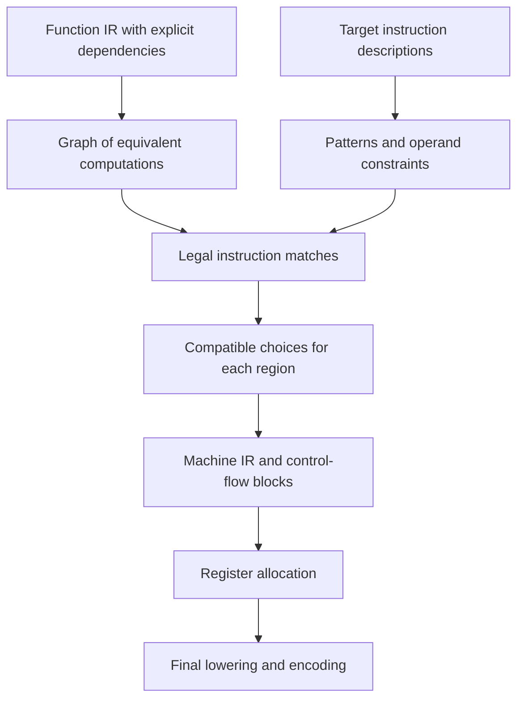
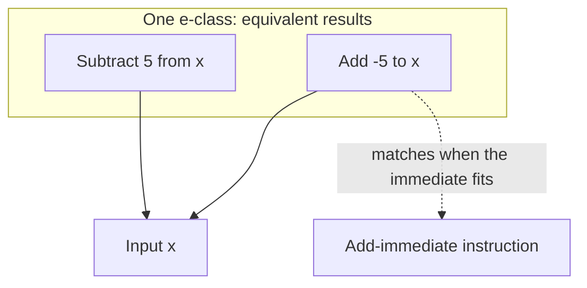
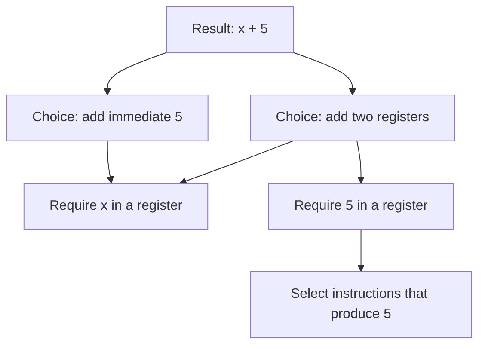
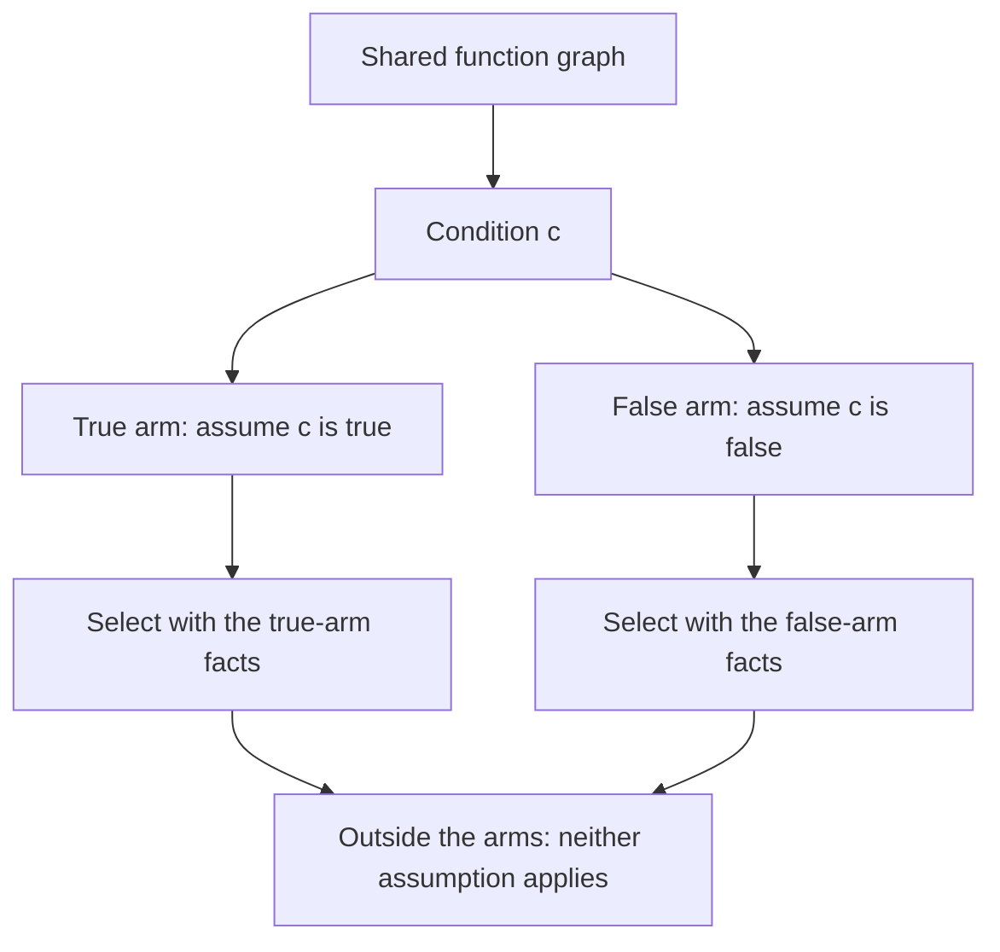

# Instruction selection

A compiler must turn a program's computations into instructions that a processor
can execute. Instruction selection decides which instructions express those
computations. The choice depends on the processor, the available instruction
extensions, and the form of each computation.

Even addition presents a choice. A processor may add two registers, or add a
small constant encoded in the instruction itself. A larger constant needs its
own instructions before the addition can use it. More complex instructions can
combine several computations into one.

TIR makes these choices by comparing the meaning of a program with the meaning
of target instructions. It retains equivalent forms of a computation, finds
instructions that match those forms, and chooses a compatible set by cost.
This chapter explains that design without requiring familiarity with TIR's
implementation.

## The input and output

TIR's intermediate representation, or IR, describes computations as operations
connected by values. A region contains part of a program, such as a function
body or a branch arm. Regions can contain other regions. The
[Core IR chapter](core_ir.md) describes this representation in more detail.

The [RVSDG and control flow chapter](rvsdg.md) explains how FCC builds these
regions and how selection turns them back into machine blocks.

Instruction selection works on a function whose data, control, and effect
dependencies are explicit. A data dependency says that an operation needs
another operation's result. A control dependency limits when an operation runs.
An effect dependency preserves required order, such as a store before a load.

The output is machine IR containing instructions for the chosen target. Values
can still use virtual registers, which name values without assigning them to
specific processor registers. Register allocation makes that assignment later.
Instruction encoding eventually turns the instructions into bytes.

Target preparation also matters. For example, unsupported integer widths need
legalization into computations the target can handle. Calls and returns need
the target's calling convention, which specifies how arguments and results
travel between functions. Semantic pattern matching is part of this larger
lowering process.

## A shared language for computations

An IR operation has a semantic description of its result and effects. Integer
addition describes an addition of values with a particular width. A memory
operation also describes its relation to memory state.

Target instructions have semantic descriptions too. TIR's machine description
language, TMDL, records instruction behavior alongside operand and encoding
information. The compiler derives selection patterns from that behavior.
See the [TMDL overview](../tmdl/index.md) for the machine description language.

For example, a RISC-V add-immediate instruction adds a register value to a
sign-extended constant. Its semantic pattern describes the addition, while its
operand constraints require a constant that fits the instruction's immediate
field. An immediate is a value stored directly in the instruction encoding.

Using the same semantic vocabulary connects the two descriptions. A target
instruction can match a computation even when the IR expresses it through
several operations. The selector still checks operand constraints. Equivalent
arithmetic alone does not make an encoding legal.

## Equivalent forms stay available

A rewrite can expose a useful instruction and hide another. Committing to one
form too early makes later choices depend on rewrite order.

TIR retains alternatives in an e-graph. An e-graph stores expressions in
equivalence classes, usually called e-classes. Each e-class groups expressions
known to compute the same result. Expressions refer to their inputs through
other e-classes, so alternatives can share their inputs.

For example, subtracting a constant can also be expressed as adding its
negation. If the target has a suitable add-immediate instruction, the addition
form exposes that choice.

The selector expands this graph with semantic rewrite rules. Shared rules
express identities, constant computations, and alternative forms of operations.
Targets can add rules that expose useful instruction sequences, including
sequences for large constants.

Repeated application of these rules is called saturation. Selection bounds the
search to control compilation time and memory use. The graph therefore contains
the alternatives discovered within those bounds, not every equivalent program.

Equivalence depends on the operation's semantics. Width, signedness, and
floating-point rules matter. A familiar algebraic identity is not permission
to ignore overflow or change floating-point rounding.

## A match covers a computation

A pattern match identifies a candidate instruction and the part of the semantic
graph that the instruction computes. This is often called a tile. Its boundary
contains the inputs that the instruction needs from elsewhere.

The distinction between an internal computation and a boundary input explains
instruction fusion. If one instruction computes both an address and a memory
access, the address arithmetic can be internal to that match. The inputs to
the address arithmetic still have to be available.

Boundary inputs have different requirements. A register input needs a value in
a suitable register. An immediate input needs an encodable constant, without a
separate register. Type information such as a width can guide a match without
requiring any runtime computation.

The selector checks those requirements before it accepts a match. It also
checks target features and the availability of values at the proposed use.
An expression elsewhere in the function does not automatically supply a usable
register here.

## Compatible choices and their cost

The cheapest match for one result may make another result impossible to
produce. Choosing each instruction independently would miss that conflict.

TIR expresses these choices as a Partitioned Boolean Quadratic Programming
problem, or PBQP. For instruction selection, the useful idea is a set of
choices with costs and compatibility constraints. Each relevant e-class has
alternatives that can produce its value. When no instruction is needed for an
e-class, the problem can include a choice that emits nothing.

A selected instruction can require another choice to supply a register input.
An immediate operand can avoid that requirement because the instruction carries
the value itself. Incompatible pairs receive a prohibitive cost.

The chosen set is a cover of the demanded computations. A demanded computation
is one whose result or effect the emitted program must preserve. Internal
expressions absorbed by a match need no separate instruction unless another
use requires them.

Costs account for declared instruction cost and encoding size. They guide the
choice between legal alternatives, but they do not predict every runtime
effect. Register pressure and later machine transformations can affect the
final result. Selection does not promise the globally cheapest machine program.

### Shared values and memory effects

Several uses can share a computed value. Selection must account for those uses
when it decides whether to keep the value in a register or compute it within a
consumer's instruction.

Effects impose stricter constraints. If two matches each include the same
effect, selecting both could execute that effect twice. The cover rejects
incompatible overlaps. State dependencies also preserve the order required by
memory operations.

This is why the selector needs more than arithmetic equivalence. The chosen
instructions must preserve the program's effects as well as its values.

## One function graph, separate region choices

TIR shares the semantic graph across a function, but chooses covers for
individual regions. The shared graph exposes computations across region
boundaries. Region-specific checks determine which values and assumptions are
valid at each use.

A branch arm provides a useful example. Inside the true arm of a condition,
the selector can use the fact that the condition is true. It applies that fact
while selecting the arm and its nested regions, then removes the assumption
before considering code outside that scope.

A repeated test inside an arm can become a known constant. The selector can
then avoid instructions that would compute or branch on that test again.
The assumption must stay within its scope. Treating it as a fact about the
whole function would change the program.

Conditional branches also have their own selection step. When a branch
instruction can test the comparison directly, the selector can combine the
comparison and branch. Otherwise, it requests the condition in a register and
uses the target's branch-on-value sequence.

## Small and large constants

Consider a 32-bit addition of `x` and `5` on a 64-bit RISC-V target. The constant
fits an immediate field. Selection can choose `addiw`, which performs the word
addition with the constant in the instruction. No instruction needs to put `5`
in its own register.

Now consider a 64-bit addition of `x` and `2048`. RISC-V's signed 12-bit
add-immediate field represents values from `-2048` through `2047`. Encoding
`2048` there would change its value, so that immediate match is illegal.

The selector can instead produce `2048` in a register, then use a
register-register addition. One valid materialization sequence starts with
`1`, shifts left by 12 bits to obtain `4096`, and adds `-2048`. Both immediate
additions fit their encoding fields.

Target rewrite rules expose such decompositions in the semantic graph.
Instruction matching and cover selection then choose instructions for the
parts. The exact sequence can change with available target features and costs.
The design requirement stays the same: every immediate must fit, and the
sequence must compute the original value.

## From selected computations to executable instructions

After selection, emitters construct machine operations and connect their
results to consumers. Covered computations give way to the selected
instructions, with effect dependencies preserved.

The compiler then converts structured control flow into machine blocks and
branches. It orders instructions according to their dependencies. This order
must make inputs available before use and preserve required effects.

Register allocation assigns physical registers afterward. Later target passes
can make choices that depend on those assignments. For example, RISC-V
compression can replace an instruction with a shorter encoding when its actual
registers and immediates meet the compressed form's restrictions.

The separation gives each stage the information it needs. Semantic selection
chooses computations and legal instruction forms. Dependency ordering preserves
execution constraints. Register allocation and final lowering complete the
machine details that depend on the selected program.
