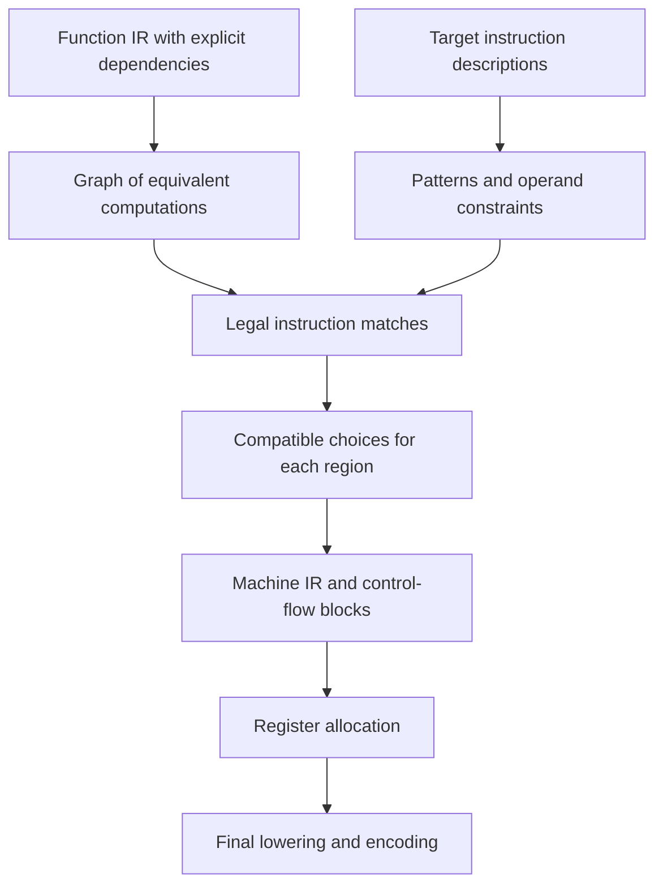
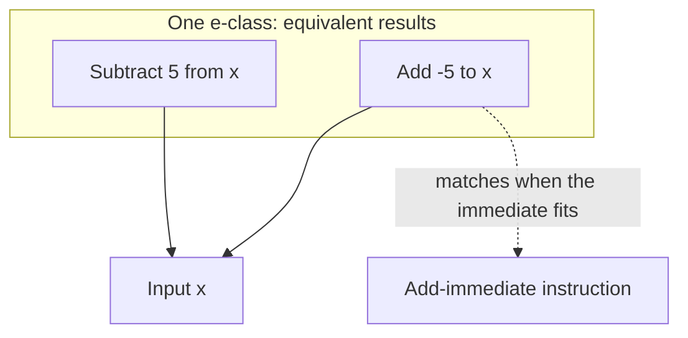
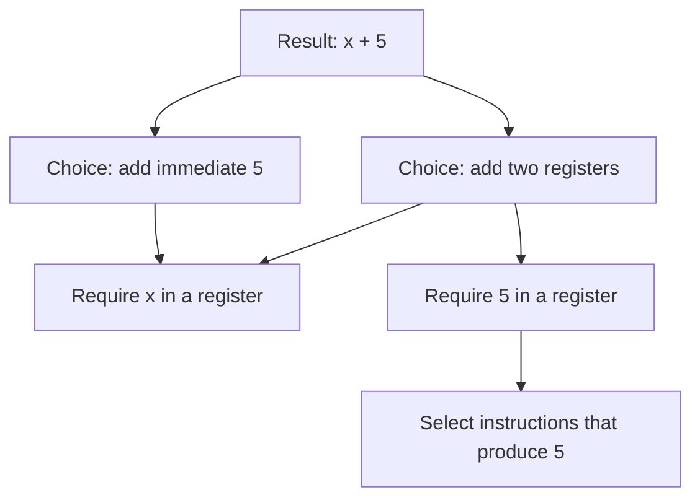
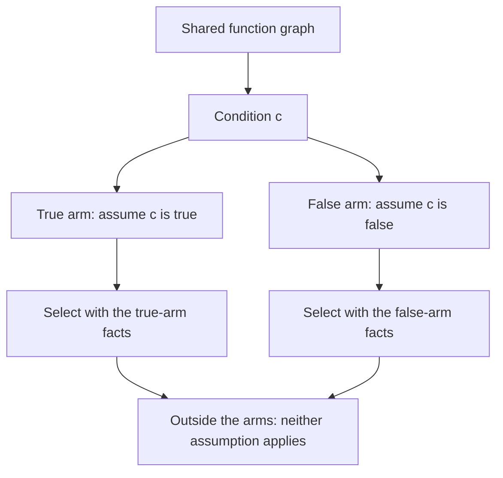

# Instruction selection

A compiler must turn a program's computations into instructions that a processor
can execute. Instruction selection decides which instructions express those
computations. The choice depends on the processor, the available instruction
extensions, and the form of each computation.

Even addition presents a choice. A processor may add two registers, or add a
small constant encoded in the instruction itself. A larger constant needs its
own instructions before the addition can use it. More complex instructions can
combine several computations into one.

TIR makes these choices by comparing the meaning of a program with the meaning
of target instructions. It retains equivalent forms of a computation, finds
instructions that match those forms, and chooses a compatible set by cost.
This chapter explains that design without requiring familiarity with TIR's
implementation.

## The input and output

TIR's intermediate representation, or IR, describes computations as operations
connected by values. A region contains part of a program, such as a function
body or a branch arm. Regions can contain other regions. The
[Core IR chapter](core_ir.md) describes this representation in more detail.

The [RVSDG and control flow chapter](rvsdg.md) explains how FCC builds these
regions and how selection turns them back into machine blocks.

Instruction selection works on a function whose data, control, and effect
dependencies are explicit. A data dependency says that an operation needs
another operation's result. A control dependency limits when an operation runs.
An effect dependency preserves required order, such as a store before a load.

The output is machine IR containing instructions for the chosen target. Values
can still use virtual registers, which name values without assigning them to
specific processor registers. Register allocation makes that assignment later.
Instruction encoding eventually turns the instructions into bytes. Full-register copies are
identified from a single assignment in the target instruction's behavior. A copy
constructor may also record its source and destination port names when fixed
operands establish a full-register copy, such as adding zero on RISC-V.
Allocation prefers placing their endpoints in the same physical register,
including copies to or from fixed ABI registers. This preference never overrides
interference or a fixed assignment. After spill insertion, copies whose current
endpoints occupy the same register are removed. Narrow register views are
excluded because a self-move can still change the rest of the register.

Before selection, the affine pass replaces supported modular address recurrences
with loop-carried values. Dead-code elimination removes the replaced arithmetic.

The selector retains matching complementary branch forms over the same inputs.
Recovery records edges that continue a loop, so machine emission can branch
back conditionally and let the exit fall through. Edge copies stay on their
original path; the existing block layout pass places their transfer blocks.

After control recovery, dead-code elimination removes unused selected values.
The machine dependence graph also records which instructions read each physical
register definition. A definition overwritten in the same block can disappear
when all its readers have disappeared. Every final register write remains
observable, so this local cleanup preserves values needed in successor blocks
and at function exits.

Target preparation also matters. For example, unsupported integer widths need
legalization into computations the target can handle. Calls and returns need
the target's calling convention, which specifies how arguments and results
travel between functions. Semantic pattern matching is part of this larger
lowering process.

## Intrinsic expansion

Operations such as `ptr.memcpy` and `ptr.memset` retain their meaning through
mid-end optimization. They implement `Intrinsic::expand`, which chooses an
implementation using scoped `TargetEnv` facts and the ordinary `Context` rewrite
APIs. The `lower-intrinsics` pass dispatches through this interface using the
existing pass walker. It visits nested modules too, and runtime declarations
belong to the nearest enclosing module.

Expansion runs before symbol-address materialization, integer legalization,
and instruction selection. It can introduce runtime declarations as well as
ordinary arithmetic and memory operations. Memory runtime calls carry
`resources ["memory"]`, so expansion does not introduce an FP-environment effect
that the original operation did not have. Calls without a resource summary
retain their conservative effects. Expansion must remove its intrinsic and
preserve its results and resource dependencies. It emits ordinary operations,
not further intrinsics.

Expansion logic belongs to the operation and is shared across targets. Target
defaults apply where the IR supplies no override. Backends report legal unaligned
scalar memory widths. Absent those facts, expansion uses byte accesses. The
x86-64 and AArch64 backends report widths of 1, 2, 4, and 8 bytes. RISC-V retains
the byte-only default because wider unaligned accesses can trap.

Memory expansion recognizes these `target_env` entries:

| Entry | Meaning | Default |
|---|---|---|
| `memory_scalar_bytes` | Additional legal unaligned integer access sizes, powers of two up to 8 bytes | None beyond byte accesses |
| `memory_copy_bytes` | Additional legal unaligned bit-copy access sizes, powers of two up to 16 bytes | None |
| `memory_inline_bytes` | Maximum constant copy or fill size considered for inlining | 64 |

A constant copy uses the widest legal accesses that fit entirely inside its
range. Its final access uses the smallest legal width covering the remaining
bytes, placed at the end of the range. This may repeat destination bytes, which
is valid because memcpy has disjoint source and destination ranges and no
volatile or atomic semantics. For example, a 31-byte copy can use two 16-byte
pairs at offsets 0 and 15. x86-64 with SSE permits 16-byte copies through its
packed load/store
instructions. These widths do not enable wide integer arithmetic or fills.
Wide register spills reserve the register's full size at the ABI slot alignment;
x86 uses unaligned packed moves for those slots. A constant fill repeats the byte
across each stored integer. Expansion also requires at most eight chunks:
each copy chunk emits one load/store pair,
and each fill chunk emits one store. This bounds the number of memory accesses
on byte-only targets as well as wide-access targets. For example, a byte-only
target inlines at most eight bytes; an eight-byte-access target can inline
64 bytes; a 63-byte copy uses eight chunks with its last access at offset 55.
This is a code-size bound, not a calibrated target cost model.

Zero-length operations forward their incoming memory state without accessing
memory. Dynamic sizes and copies or fills exceeding either budget use a runtime
call.

## A shared language for computations

An IR operation has a semantic description of its result and effects. Integer
addition describes an addition of values with a particular width. A memory
operation also describes its relation to memory state.

Target instructions have semantic descriptions too. TIR's machine description
language, TMDL, records instruction behavior alongside operand and encoding
information. The compiler derives selection patterns from that behavior.
See the [TMDL overview](../tmdl/index.md) for the machine description language.

For example, a RISC-V add-immediate instruction adds a register value to a
sign-extended constant. Its semantic pattern describes the addition, while its
operand constraints require a constant that fits the instruction's immediate
field. An immediate is a value stored directly in the instruction encoding.

Using the same semantic vocabulary connects the two descriptions. A target
instruction can match a computation even when the IR expresses it through
several operations. The selector still checks operand constraints. Equivalent
arithmetic alone does not make an encoding legal.

## Equivalent forms stay available

A rewrite can expose a useful instruction and hide another. Committing to one
form too early makes later choices depend on rewrite order.

TIR retains alternatives in an e-graph. An e-graph stores expressions in
equivalence classes, usually called e-classes. Each e-class groups expressions
known to compute the same result. Expressions refer to their inputs through
other e-classes, so alternatives can share their inputs.

For example, subtracting a constant can also be expressed as adding its
negation. If the target has a suitable add-immediate instruction, the addition
form exposes that choice.

The selector expands this graph with semantic rewrite rules. The rules are
shared by every target and live in `core/defs/isel.pdl`. They express
identities, constant computations, and alternative forms of operations. A rule
never names a target: the graph keeps every form, and the target's instruction
patterns decide which forms selection can cover. The only target fact a rule
reads is whether one of the target's instructions materializes a constant
alone, which the patterns derived from its machine description answer.

Repeated application of these rules is called saturation. Selection bounds the
search to control compilation time and memory use. The graph therefore contains
the alternatives discovered within those bounds, not every equivalent program.

Equivalence depends on the operation's semantics. Width, signedness, and
floating-point rules matter. A familiar algebraic identity is not permission
to ignore overflow or change floating-point rounding.

## A match covers a computation

A pattern match identifies a candidate instruction and the part of the semantic
graph that the instruction computes. This is often called a tile. Its boundary
contains the inputs that the instruction needs from elsewhere.

The distinction between an internal computation and a boundary input explains
instruction fusion. If one instruction computes both an address and a memory
access, the address arithmetic can be internal to that match. The inputs to
the address arithmetic still have to be available.

Boundary inputs have different requirements. A register input needs a value in
a suitable register. An immediate input needs an encodable constant, without a
separate register. Type information such as a width can guide a match without
requiring any runtime computation.

The selector checks those requirements before it accepts a match. It also
checks target features and the availability of values at the proposed use.
An expression elsewhere in the function does not automatically supply a usable
register here.

## Compatible choices and their cost

The cheapest match for one result may make another result impossible to
produce. Choosing each instruction independently would miss that conflict.

TIR expresses these choices as a Partitioned Boolean Quadratic Programming
problem, or PBQP. For instruction selection, the useful idea is a set of
choices with costs and compatibility constraints. Each relevant e-class has
alternatives that can produce its value. When no instruction is needed for an
e-class, the problem can include a choice that emits nothing.

A selected instruction can require another choice to supply a register input.
An immediate operand can avoid that requirement because the instruction carries
the value itself. Incompatible pairs receive a prohibitive cost.

The chosen set is a cover of the demanded computations. A demanded computation
is one whose result or effect the emitted program must preserve. Internal
expressions absorbed by a match need no separate instruction unless another
use requires them.

Costs account for declared instruction cost and encoding size. They guide the
choice between legal alternatives, but they do not predict every runtime
effect. Register pressure and later machine transformations can affect the
final result. Selection does not promise the globally cheapest machine program.

### Narrow operations

A target may compare, shift right, or divide only at its register widths.
RISC-V compares 64-bit registers; AArch64 compares 32- or 64-bit registers;
x86-64 also has 8- and 16-bit forms. Addition, multiplication, and bitwise
operations need no special handling, because their low result bits read only
the low bits of their operands. A comparison, a right shift, or a division
reads every operand bit. Shared rules therefore give each narrow form an
equivalent computed on extended operands: comparisons at 32 and 64 bits, right
shifts at 32 bits, and 8-bit divisions at 32 bits. The axiom proofs cannot
bit-blast a division of wider inputs. A comparison keeps its one-bit result. A
shift or division yields the low bits of the wide result, so the narrow value
becomes a low-bit view of the wide computation.

A view reads its source's register and needs no instruction of its own. When a
rewrite introduced the source, no IR operation computes it, and its only
readers are views. Selection may then leave the source uncomputed and select
each view with an instruction of its own. The cover makes this choice by cost:
x86-64 keeps its 8-bit `shr`, and RISC-V shifts the extended value with `srlw`.

### Shared values and memory effects

Several uses can share a computed value. Selection must account for those uses
when it decides whether to keep the value in a register or compute it within a
consumer's instruction.

An effect can execute as its own tile or inside a selected tile that owns it.
The latter choice requires that exact owner and does not provide a register for
an independent reader. State edges between accesses inside one instruction
contract to its external state ports. An indirect dependency through an
external state producer or register operand prevents contraction: it would
make the instruction depend on its own publication. The existing dependency
DAG supplies reachability for this legality check. Independent state inputs
remain external ports. Register demands across regions remain separate from
effect demands. Child regions can reuse registers actually produced for
ancestor effects, while pure computations retain the demand analysis's
choice to recompute.

Extending loads retain both their narrow and full behavior-derived patterns.
Extension widths are structural integers, so their matching does not depend on
the bit width used to encode an IR attribute.

Effects impose stricter constraints. If two matches each include the same
effect, selecting both could execute that effect twice. The cover rejects
incompatible overlaps. State dependencies also preserve the order required by
memory operations.

This is why the selector needs more than arithmetic equivalence. The chosen
instructions must preserve the program's effects as well as its values.

## One function graph, separate region choices

TIR shares the semantic graph across a function, but chooses covers for
individual regions. The shared graph exposes computations across region
boundaries. Region-specific checks determine which values and assumptions are
valid at each use.

A branch arm provides a useful example. Inside the true arm of a condition,
the selector can use the fact that the condition is true. It applies that fact
while selecting the arm and its nested regions, then removes the assumption
before considering code outside that scope.

A repeated test inside an arm can become a known constant. The selector can
then avoid instructions that would compute or branch on that test again.
The assumption must stay within its scope. Treating it as a fact about the
whole function would change the program.

Conditional branches also have their own selection step. A control-recovery
plan identifies their predicates before source operations are replaced. When
a predicate can directly own its continuation and a branch instruction can
test its comparison, the selector can combine the comparison and branch.
The plan assigns a stable identity and an outcome partition to each predicate
definition. A predicate returned by a Gamma arm is selected in that arm, before
its outcome crosses the region boundary. Structural consumers route these
outcomes without owning another branch.

A predicate with data uses retains the value those readers need. A local
conversion can fuse a pure comparison when its inputs are available there.
If placement rejects a continuation, selection discards the staged function
and retries with its connected selector roles materialized. Those replacement
tests must read the materialized value. Every retry permanently demotes at
least one definition; a request that cannot demote a definition fails before
reselection. Recovery reports placement conflicts together. A fused branch
may only read operands available where
it executes.

Each selected instruction inherits its source computation's demand domain.
Effectful computations from different lazy-loop paths cannot be fused into
one instruction. A branch cannot internalize a resource effect whose state
it does not publish.

## Small and large constants

Consider a 32-bit addition of `x` and `5` on a 64-bit RISC-V target. The constant
fits an immediate field. Selection can choose `addiw`, which performs the word
addition with the constant in the instruction. No instruction needs to put `5`
in its own register.

Now consider a 64-bit addition of `x` and `2048`. RISC-V's signed 12-bit
add-immediate field represents values from `-2048` through `2047`. Encoding
`2048` there would change its value, so that immediate match is illegal.

The selector can instead produce `2048` in a register, then use a
register-register addition. One valid materialization sequence starts with
`1`, shifts left by 12 bits to obtain `4096`, and adds `-2048`. Both immediate
additions fit their encoding fields.

Shared rewrite rules expose such decompositions in the semantic graph. They fire
only on constants that none of the target's materializing instructions
produces alone. One rule splits off a signed 12-bit low part for an immediate
addition. Others insert a 16-bit halfword into a narrower constant. Instruction
matching and cover selection then choose instructions for the parts. The exact sequence can change with available target features and costs.
The design requirement stays the same: every immediate must fit, and the
sequence must compute the original value.

LLVM input conversion retains binary-operation no-wrap flags. A sign extension of an `add nsw`
or `sub nsw` with a constant operand can be expressed as wider arithmetic on
sign-extended operands. The constant is interpreted at its source width first.
Other uses retain the narrow operation; unflagged and unsigned-only arithmetic
retain wrapping before sign extension. This conversion uses LLVM's guarantee
that signed overflow does not occur on defined executions and introduces
ordinary TIR operations for selection. GEP conversion scales the variable and
constant parts of these signed additions separately. It adds dynamic offsets
to the base before literal offsets, and returns the base directly for zero
offsets, exposing shared products and displacement addressing to selection.
A constant displacement at the end of a previously converted GEP is combined
with the new displacement using wrapping byte arithmetic. The earlier address
remains intact for its other users.

For constant-arm selects, shared selection axioms rewrite the mask blend as
an XOR with the differing constant bits. A one-bit mask is reduced through an
explicit low-bit extraction before zero extension, preserving correctness when
its physical register has unspecified upper bits.
Shared zero identities remove a zero-valued `and` arm and its surrounding `or`
before instruction matching, so a lowered select with a zero arm does not
require a separate mask chain.

Frames use the stack pointer as their base, so the ABI's optional frame-pointer
register remains available for allocation. Its ordinary callee-save obligation
still applies; stack, return-address, and explicitly reserved registers remain
excluded.

Register allocation can replay an immediate producer instead of spilling its
value. Replay sites retain block order so fresh register numbering and allocation
remain reproducible across compiler processes. A target can also identify a symbol-address instruction whose independent
relocation computes the same address at every replay site. x86-64 permits this
for symbolic RIP-relative `lea`; arbitrary numeric PC-relative computations do
not acquire that guarantee from the symbol-address hook.

## From selected computations to executable instructions

Selection planning and emission run in a fork of the current context. Emitters
construct machine operations there and connect their results to consumers.
Covered computations give way to the selected instructions, with effect
dependencies preserved. The source context remains available if the candidate
is rejected.

Predicative recovery then connects computation fragments using the saved
control provenance and region bindings. Fused-branch inputs receive the same
simultaneous substitutions as edge arguments. The compiler orders each block
according to its machine dependencies before adopting the staged result.
This order must make inputs available before use and preserve required effects.

Register allocation assigns physical registers afterward. Later target passes
can make choices that depend on those assignments. For example, RISC-V
compression can replace an instruction with a shorter encoding when its actual
registers and immediates meet the compressed form's restrictions.

The separation gives each stage the information it needs. Semantic selection
chooses computations and legal instruction forms. Dependency ordering preserves
execution constraints. Register allocation and final lowering complete the
machine details that depend on the selected program.
