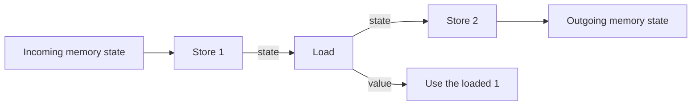
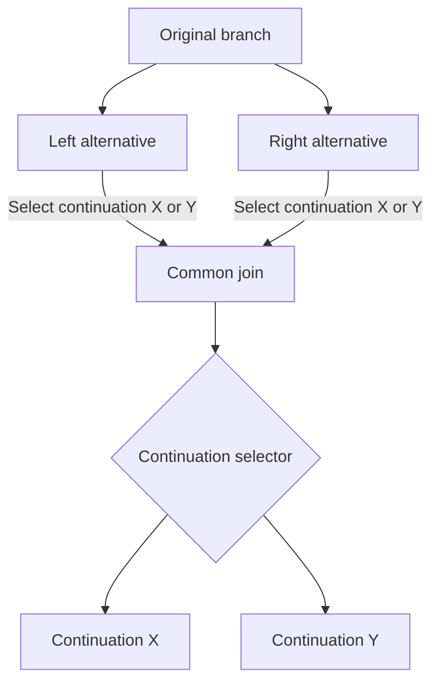
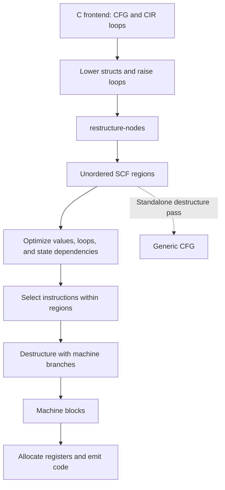

# RVSDG and control flow

A compiler needs to preserve which computations run, which values they produce,
and the order of their effects. TIR expresses those relationships in two forms.
A control-flow graph, or CFG, uses ordered basic blocks connected by branches.
A Regionalized Value State Dependence Graph, or RVSDG, uses nested regions
connected by value and state dependencies.

TIR converts function bodies from CFG form into unordered regions for
optimization and instruction selection. It then builds blocks containing the
selected machine instructions. The two conversions preserve the computation
and its effects. The resulting blocks need not match the original blocks.

This chapter explains those conversions and their place in FCC, TIR's C
compiler. The [Core IR chapter](core_ir.md) introduces the storage shared by
both forms. The [original RVSDG paper](https://arxiv.org/html/1912.05036v2)
provides background on regional value and state dependencies.

## Regions express the structure of a computation

An operation consumes values and produces results. A region contains operations
and exposes results of its own. Some operations own nested regions. A function
owns its body, a conditional owns its alternatives, and a loop owns its body.

In CFG form, each basic block contains an ordered sequence of operations.
A terminator ends the block with a branch or a return. Branches can pass values
to the next block's arguments.

In RVSDG form, a region contains unordered operations. Their position in the
text does not determine execution order. If a multiplication consumes an
addition's result, the addition must run first. Independent computations have
no order unless another dependency imposes one.

Region arguments are also called ports. The enclosing operation supplies their
values. A nested region can read visible values from its enclosing scope, while
its results expose values to the enclosing operation. A value produced in one
conditional alternative becomes available outside that alternative through the
conditional's results.

TIR uses three SCF operations to express this structure:

- `scf.switch` selects one alternative and produces that alternative's results.
  Its integer predicate indexes the alternatives. A value beyond the last
  index selects the last alternative.
- `scf.loop` carries values through repeated evaluations of a body region.
  The body produces a repeat predicate, values for the next iteration, and
  values to return when the loop stops.
- `scf.for` is a counted loop. It makes the counter, bounds, and step explicit
  so loop transformations can use them.

The `Gamma` interface describes a conditional's predicate and alternatives.
The `Theta` interface describes a loop's predicate and carried values. Passes
use these interfaces to read the bindings between operands, ports, and results.
Both `scf.loop` and `scf.for` implement `Theta`.

## State dependencies preserve effects

Value dependencies alone cannot order a store and a later load from the same
address. TIR uses state values to express dependencies on resources such as
memory. A memory operation observes an incoming state and produces a state
that later operations can depend on.

For example, a store of `1`, a load, and a store of `2` must preserve the load's
observation of `1`. The state dependencies preserve that order after the block
containing those operations disappears.

The conversion constructs missing dependencies while the original block order
is still available. It identifies memory objects and builds separate chains
where the accesses permit them. Memory with unknown provenance uses a world
chain. Accesses that may refer to the same memory must remain ordered against
each other.

Reads can share the state left by a preceding write. Their outgoing states
join before a subsequent write that must follow all those reads. An operation
that affects several chains joins their states. The conversion splits the
resulting state when later operations need to name the chains separately.

State dependencies cross conditionals and loops along with ordinary values.
Region state results keep required effects connected to the function's result.
The unordered representation therefore retains the order that matters without
retaining the order of every operation in a block.

## CFG restructuring builds nested regions

The `restructure-nodes` pass converts an ordered function body into unordered
regions. A function that already has an unordered body needs no conversion.
A single ordered block still needs conversion, even when it contains no branch.

The pass first builds a temporary graph. Each node refers to an original block,
and each edge records a destination and assignments to its arguments. Values
used across blocks become typed variables in this graph. Generated control
selectors use the same variable representation. Compatible function exits
converge on one exit node.

The pass structures loops first, then branches, and finally emits the regions.
Original computations move into their new regions without being copied.

### Loops converge on one entry and one exit

A cycle in a CFG represents repeated execution. The pass uses Tarjan's
algorithm to find strongly connected components: sets of blocks that can all
reach one another. Cyclic components identify the parts that need loop
structure.

When a component already has a suitable tail decision, the pass preserves that
decision as the repeat predicate. Otherwise, it introduces a common head and
tail. Selectors record which original entry an incoming edge wanted, whether
the iteration repeats, and which exit to take when it stops.

Consider a cycle that can be entered at either block A or block B. The incoming
edge supplies an entry selector. One loop head then dispatches to A or B,
preserving the original choice without copying either block. A loop with
several exit destinations uses an exit selector to make the corresponding
choice after the loop.

The pass repeats this process inside each loop body to form nested loops.
The enclosing graph treats a completed loop as one unit and follows its exit
when it looks for the surrounding structure.

### Branches converge on a continuation

A structured conditional has alternatives followed by a common continuation.
For a CFG branch, the pass examines the blocks reachable from each alternative
to find where their paths meet.

When the paths meet at one entry to their shared continuation, that entry is
the join. When several joins are possible, the pass creates a selector and a
common dispatch. Each incoming path records which continuation it wanted.

The alternatives keep their original computations. The extra selector makes
their control choice a value that can cross a region boundary. The result of
branch restructuring is a tree describing the nested conditionals and loops.

### Live values determine the region results

Restructuring must also preserve values passed between blocks. The pass
computes liveness by tracing which variables later operations and edges read.
A variable is live at a point when its current value is still needed there.

A conditional produces a result for a variable that an alternative assigns
and the continuation needs. Values available in the enclosing scope can be
read directly inside an alternative. The emitted conditional forwards state
dependencies through explicit ports.

A loop carries the variables its body assigns that are needed by another
iteration or after the loop. Its initial operands supply the first iteration's
ports. The body then supplies separate continuation and exit values.

Emission turns the temporary variables back into value references and region
bindings. It creates `scf.switch` and `scf.loop` operations for the tree, and
converts preserved counted loops into `scf.for`. The function's return values
and outgoing states become region results. An unordered region has no return
terminator inside it.

### Input boundaries

The CFG reader uses the `Terminator`, `BranchTerminator`, and `BranchGuard`
interfaces. It accepts unconditional branches and two-way conditional branches
whose guard describes both edges. Branches with more than two successors need
lowering before this conversion.

The input also needs an exit node. Multiple exits must have compatible
terminators and operands so the pass can combine them. These requirements
apply to the input representation, including graphs with multiple-entry loops
or several loop exits.

## Predicates determine the recovered control flow

The standalone `destructure` pass and CPU code generation use predicative
control-flow recovery. A private recovery plan records predicate definitions,
region bindings, and the computations each path demands before instruction
selection replaces the source operations.

Recovery first prepares computation fragments, producer-owned control
definitions, and unresolved continuations. Each definition has a finite set of
exact or default outcomes. A separate routing map records which outcome a
conditional or loop consumes. FINISH starts at the definition, selects an
outcome, and follows its fact through region bindings to the next computation.
A structural operation need not become a branch or a merge block. For example,
when a conditional produces `false` as a loop's repeat selector, that outcome
can reach the loop exit directly without storing and retesting the boolean.

The algorithm follows the PREPARE and FINISH organization of
[Bahmann et al.'s predicative recovery](https://www.sjalander.com/research/pdf/reissmann-PhD-thesis.pdf#page=129).
The private representation adapts TIR's demand semantics and preserves SSA
values. It does not imply the paper's exact-reconstruction guarantee for every
optimized TIR program.

### Control predicates and ordinary values

A boolean used as ordinary data must remain available to its readers. Recovery
cannot eliminate its computation merely because it also selects a branch.
When a producer's successor structure prevents a legal control definition,
normalization retains its value and creates a consumer-local conversion. The
conversion owns a new control definition at that consumer. Normalization does
not add dependency edges to force an invalid order or duplicate effects.
Consumers share a direct definition only when their outcome partitions agree.
A wider selector used by conditionals with different arm counts requires a
local conversion for the incompatible consumer.

Constant selectors can pass through several boundaries. Their facts travel
together with the corresponding value bindings, so a loop's entry, repetition,
and exit selectors keep their correlation. Recovery stops at computations
whose execution is still required. Pure literal definitions do not interrupt
this tracing. FINISH places the surviving literals along paths that dominate
their uses, stopping at joins so loop invariants are not rematerialized on each
iteration. Within a fragment, literals wait until their first reader; a literal
needed only beyond the terminator follows the fragment's computations.
A constant replaced under an arm's selection assumption is a local
fact, not evidence that its replacement is constant on every path. Routes
carry only dynamic facts; literal values remain in a shared table. A backedge
forgets facts owned by the loop body and facts whose owner is unknown.

### Loop paths keep their demand semantics

A `Theta` body exposes a predicate, continuation values, and exit values.
The predicate's dependencies and the computations shared by both outcomes
run before the decision. The remaining computations run only on the selected
path. A continue-only load or trap must not execute when the loop exits; an
exit-only store must not execute on continuation.

The private plan represents this split as a canonical loop containing a
conditional. Its true arm computes feedback values and produces a true repeat
selector. Its false arm computes exit values and produces a false selector.
Each original computation keeps one execution owner, including each resource
state transition. An effect that no result demands remains an error.

A counted loop can use the same comparison for a Gamma and its repetition
result. When the mandatory Gamma yields both the feedback and exit tuples,
normalization adds a private Boolean result to its alternatives. Each arm
assigns that result after its computations, and the Theta reads it instead of
using the comparison a second time. This control port has its own identity;
its fact is cleared between iterations. If later placement loses that fact,
recovery discards the candidate and restores a materialized repetition test.

### Edges preserve simultaneous value transfer

Crossing a region boundary changes the names through which computations read
values. Recovery composes these bindings simultaneously. A loop edge swapping
`x` and `y` must read both incoming values before writing either next-iteration
value. Surviving joins and loop entries use block arguments; existing machine
SSA destruction later implements their parallel copies. Those copies sit
between a block's conditional branch and its fallthrough branch, so register
liveness treats every terminator as its own exit: a parameter the taken edge
still reads stays live across the copy that redefines it for the fallthrough.
The interference graph also retains the conservative block-exit live set.
Per-terminator joins supplement it rather than relaxing existing coalescing
constraints on fallthrough copies.
Blocks created for branch-edge assignments follow their source block. This
keeps layout tie-breaking independent of late edge-block allocation and lets
short loop backedges become fallthroughs.

The `Edges` adapter supplies generic CFG or target branch operations. Selected
branches are identified by stable control definition and outcome IDs. Their
register inputs are remapped through the same bindings as ordinary operands.
This includes inputs captured inside a fused comparison and its branch prelude.

### SPIR-V explicitly retains structured recovery

SPIR-V calls `recover_structured` on a copy of the function. This path preserves
selection merges and loop header, continuation, and merge records for
`OpSelectionMerge` and `OpLoopMerge`. CPU recovery can produce control flow
that does not have those structural records, so it does not return them.

## FCC keeps regions through instruction selection

FCC initially represents ordinary control flow as blocks and branches. Its
C-specific `cir` dialect provides loop operations that preserve the source
condition, body, and step regions where the frontend can retain that structure.

Before restructuring, `raise-loops` recognizes counted loops and represents
them as `scf.ordered_for`. The restructuring pass converts those operations
to unordered `scf.for` bodies. Retaining the counter and bounds gives
[affine loop scheduling](affine.md) the structure it needs.

Loops that `raise-loops` cannot prove counted become CFG blocks and take the
general restructuring path. A label or `goto` anywhere in a function, or a
return inside a loop, makes the frontend flatten all loops in that function.

FCC runs struct lowering, loop raising, and restructuring at every optimization
level. Optimizing levels then run inlining, memory-slot promotion, dependency
verification, and simplification over the unordered representation. Inlining
replaces a call with the called function's computation. Promotion replaces
eligible local loads and stores with value dependencies. At `-O2` and `-O3`,
affine scheduling can reorder counted loops or group their iterations into
tiles while respecting dependencies. Machine emission at `-O0` still runs the
normalizing simplifier. An `-O0` IR dump shows the frontend conversion before
that simplification.

Instruction selection processes the nested unordered regions against the
recovery plan. It stages selected instructions and control-flow recovery in a
private context, then publishes the result only after machine dependencies
admit an order. Register allocation and final emission consume those blocks.
The [Instruction selection chapter](isel.md) explains how TIR chooses the
instructions.

The shared backend also accepts raw CFG input from other clients. Its prologue
runs `restructure-nodes` before selection and verifies the state dependencies.
Functions that already have unordered bodies retain their existing structure
and dependencies.
