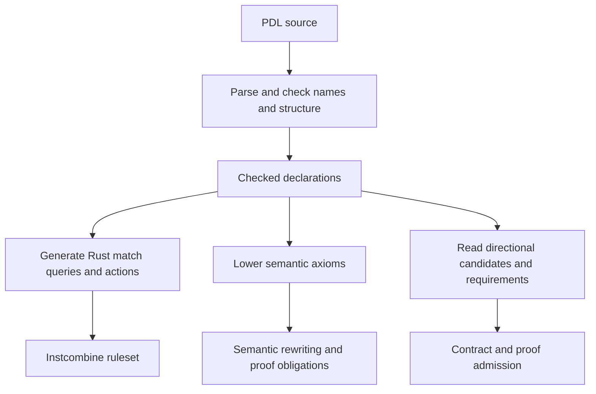

# PDL: the pattern description language

PDL is TIR's language for describing expression rewrites. A rule states what
to recognize, what expression can replace it, and which conditions justify
that replacement. Shared compiler engines find matches and apply the rules.
The author does not need to write a graph traversal for each identity.

For example, adding zero leaves an integer unchanged:

```pdl
rule add-zero: builtin.addi(x: int<W>, 0) => x;
```

`builtin.addi` names the IR operation. `x` names its first operand, and
`int<W>` binds that operand's integer width to `W`. The literal `0` matches
the other operand. The right-hand `x` refers to the same value matched on
the left.

This page explains what the language is for and how rules reach an engine.
The [language reference](reference.md) gives the complete declaration forms,
binding rules, expressions, and consumer restrictions. The
[instcombine chapter](../design/instcombine.md) explains an engine that uses PDL.

## Expressions, not source text

A compiler's intermediate representation, or IR, connects operations through
typed values. PDL matches those computations rather than the text of a source
program. A rule can apply regardless of the source variable names or the
frontend that produced the operations.

Patterns can describe several connected operations:

```pdl
rule cancel-add: builtin.subi(builtin.addi(x: int<W>, y), y) => x;
```

This reads as `(x + y) - y = x` for the matched integer computation. Both
occurrences of `y` must denote the same value. The pattern does not require
the operations to be adjacent in a printed listing.

Types and operation semantics determine whether the rule is correct.
Fixed-width integer arithmetic can wrap; floating-point arithmetic rounds.
The same algebraic-looking replacement does not necessarily work for both.
PDL makes types and conditions available to express that distinction.

## What the language separates

A rewrite has several independent concerns. Its pattern describes the
computation. Its conditions describe when the relationship holds. Its proof
mode records the required justification. The engine determines when to
search for the pattern and how to use a successful match.

This separation has practical goals:

- An identity is readable without understanding the traversal that finds it.
- Related rules share matching, scheduling, and graph maintenance.
- Widths, constants, and other restrictions are explicit in the rule.
- Equivalences can support both optimization and reasoning about computations.
- A directional change retains its contract instead of being mistaken for
  unconditional equality.

PDL does not itself choose processor registers, schedule instructions, or
decide which discovered expression is cheapest. It also does not prove a rule
merely by accepting its syntax.

## Two vocabularies for different levels of reasoning

Concrete operation patterns use `dialect.operation` names, such as
`builtin.addi`. A dialect is a family of IR operations and types. These
patterns describe the operations present in the IR and are useful when a
rewrite will construct new IR operations.

Semantic patterns use `#operator` names:

```pdl
rule semantic-add-zero: #add(x: int<W>, 0) : int<W> => x;
```

`#add` describes addition in TIR's shared semantic vocabulary. Instruction
selection uses this vocabulary to relate program computations to the behavior
of machine instructions. A semantic addition can arise from different IR
operations whose behavior is expressed that way.

The two spellings therefore carry different information. Concrete operation
identity matters to IR construction. Semantic expressions matter to proofs
and to matching instruction behavior. PDL provides syntax for both, while
each consumer supports the forms it can interpret safely.

TMDL has a separate role. It describes instructions, encodings, and machine
behavior. PDL describes relationships between computations. The
[instruction selection chapter](../design/isel.md) explains how these
descriptions meet, and the [TMDL overview](../tmdl/index.md) introduces the
machine description language.

## Equalities retain alternatives

TIR's rewrite engines can store expressions in an e-graph. An e-graph groups
expressions into equivalence classes, each representing one value. A rule
adds another expression to the class instead of immediately deleting the
matched expression.

Consider a power-of-two multiplication:

```pdl
rule mul-pow2-to-shl:
	builtin.muli(x: int<W>, c: const) => builtin.shli(x, const<W>(ctz(c)))
	where popcount(c) == 1, c != 1;
```

`c: const` requires a known constant. The guards establish that it has one
set bit and is not one. For `c = 8`, `ctz(c)` is three, so the replacement
describes `x << 3`.

After the rule fires, the graph knows that `x * 8` and `x << 3` are equivalent.
Other rules can use either form. Instcombine later chooses expressions by
cost. Instruction selection uses alternatives to find suitable machine
instructions.

The arrow gives a search direction, not a claim that the engine immediately
performs a destructive edit. Repeated rule application is called saturation.
Practical engines bound it to control compilation time and memory use.

## Refinements preserve the direction of permission

Some optimizations are permitted without being exact equalities. Fusing a
floating-point multiply and add into one instruction can round once instead
of twice. Whether that change is legal depends on the program's contract.

PDL expresses such a candidate with `refinement` and `~>`, together with
requirements such as permission to contract a multiplication and addition.
A separate consumer checks those requirements and admits the directional
change. Treating the two computations as unconditionally equal would lose
the contract's meaning.

Proof modes distinguish solver obligations, trusted assertions, definitional
laws, and contract checks. The [proof reference](reference.md#proof-modes)
explains their defaults and limits. A rule accepted by the parser can still
be unsupported by a prover or rejected by a consumer.

## From a PDL file to a running rewrite

PDL processing begins with a shared frontend. It tokenizes and parses the
source, then checks bindings and structural restrictions. The result is a
checked syntax tree describing declarations, patterns, and conditions.



For instcombine, Rust generation happens during the compiler build. A pattern
becomes a relational query. Its conditions become guards, and its replacement
becomes graph actions plus a way to construct any required IR operation.
The compiled pass uses those descriptions at runtime without reparsing PDL.

Semantic consumers interpret the same checked syntax through their own
operation and proof models. They can support constructs that the IR-emitting
path does not, such as nested semantic replacements and constant
materialization. Conversely, the scalar expressions accepted by one consumer
need not be accepted by another.

This is why a usable rule needs more than valid syntax. Its operations must
be represented in the host graph, its conditions must be executable by the
consumer, and any new operation needs an emission path. The rule also needs
the correctness evidence required by its proof mode. The
[consumer support table](reference.md#consumer-support) makes these boundaries
explicit.

## Where a new rule belongs

An identity over concrete IR operations fits the instcombine ruleset when
that pass can match and emit the required forms. An identity over shared
semantic expressions fits semantic rewriting when it helps expose instruction
matches or express a proof. A target-specific constant decomposition belongs
with the target whose instruction constraints motivate it.

A contract-governed floating-point change belongs to the refinement path.
Its direction and permissions are part of the transformation, not optional
annotations on an equality.

The reference distinguishes syntax checking, consumer lowering, and proof
checking. These answer different questions: whether a rule is well formed,
whether the engine can execute it, and whether its claim is justified.
